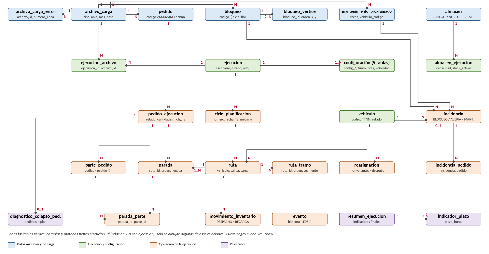

# Documento de Diseño de Estructura de Datos — PaqRap · Centro de Operaciones

> **Fuente única del modelo de datos** (Equipo 6F · 1INF54-0983 · PUCP 2026-2). Versión 1.0 · 30/09/2026.
> El backend (Spring Boot, Java 25) implementa el esquema a partir de este archivo; el documento
> `24.dis.estructura.datos.v01.docx` es su versión con formato del curso. Si ambos difieren, prevalece este archivo.
> Las decisiones marcadas **DD-xx** (sección 11) están **pendientes de aprobación del usuario**.

## Historial de versiones

| Fecha | Versión | Descripción | Autor(es) |
|---|---|---|---|
| 30/09/2026 | 1.0 | Versión inicial del documento | Equipo 6F |

# 1. INTRODUCCIÓN

## 1.1. Propósito

Este documento define la estructura de datos persistente de la solución PaqRap – Centro de Operaciones: las entidades, sus atributos, tipos, claves, relaciones, restricciones, catálogos e índices que servirán de base para escribir el DDL de la base de datos relacional del servidor. También identifica qué datos del cliente web y del componente planificador son persistentes, cuáles se derivan y cuáles son efímeros (solo de visualización o de tiempo real), para que el equipo implemente la persistencia sin ambigüedades.

## 1.2. Alcance

El documento cubre:

* Los datos maestros y de carga: almacenes, demanda de pedidos (archivos de ventas 2026–2028), bloqueos planificados, plan de mantenimiento preventivo y el registro de los archivos cargados, que se cargan **antes** de cualquier simulación y son reutilizados por todas las ejecuciones y escenarios.
* Los datos de cada ejecución (Día a día, Simulación 5D y Colapso): configuración completa, flota, estado de los pedidos, partes, ciclos de planificación, rutas, paradas y recorridos, inventario y sus movimientos, incidencias, reasignaciones, bitácora de eventos, diagnóstico de colapso e indicadores finales.
* Los catálogos y parámetros del sistema, las máquinas de estado propuestas y la correspondencia entre tablas, clases del núcleo Java y tipos del cliente web.
* Las tablas de seguridad (usuarios y roles), marcadas como **opcionales**, porque la arquitectura solo las propone.

El SGBD elegido es **PostgreSQL** (decisión DA-10 del DAS, cerrada el 30/09/2026; DD-31). Queda fuera del alcance la elección del marco de persistencia y el DDL definitivo, que se escribirá en PostgreSQL a partir de este diccionario. El diccionario usa tipos SQL estándar; la sección 2.3 indica su equivalente en PostgreSQL.

## 1.3. Definiciones, siglas y abreviaturas

| Término | Definición |
|---|---|
| BD / SGBD | Base de datos / Sistema gestor de base de datos relacional. |
| DDL | Lenguaje de definición de datos (sentencias `CREATE TABLE`, `CREATE INDEX`, …). |
| PK / FK / UK | Clave primaria / clave foránea / clave única (restricción de unicidad). |
| CHECK | Restricción de dominio evaluada por el SGBD en cada fila. |
| Dato maestro | Dato cargado una vez e inmutable, reutilizado por varias ejecuciones (demanda, bloqueos, plan de mantenimiento, almacenes). |
| Ejecución | Una corrida de un escenario (Día a día, 5D o Colapso) con su configuración, su reloj simulado y sus resultados. |
| Ciclo de planificación | Invocación del planificador en un instante simulado t; se repite cada Sa minutos simulados y ante incidencias. |
| Sa | Salto de simulación: minutos simulados entre dos ciclos de planificación. |
| Sc / K | Ventana de consumo y factor de anticipación del ALNS histórico (Sc = Sa × K); el modelo vigente no anticipa demanda (Sc = 0). |
| Ta | Tiempo de ejecución del algoritmo en un ciclo (ms reales). |
| TS / ALNS | Tabu Search (algoritmo seleccionado) / Adaptive Large Neighborhood Search. |
| Parte de pedido | Fracción indivisible (≤ 4 paquetes por defecto) en que se divide la cantidad pendiente de un pedido para planificarla y entregarla. |
| Ruta | Un viaje de una unidad: sale de un almacén, atiende paradas en orden y vuelve a un almacén. |
| Parada | Visita de una ruta a un cliente; agrupa las partes consecutivas de un mismo pedido y consume 1 h de servicio. |
| Ruta comprometida | Ruta cuya salida ocurre antes del siguiente ciclo; se despacha (descuenta stock) y deja de ser provisional. |
| Holgura | Minutos entre el instante de entrega considerado y la hora límite del pedido (positiva = a tiempo). |
| Instante simulado | Fecha-hora del reloj de la simulación (no del reloj de pared). |
| TTNN | Código de unidad: tipo (TA, TM, TB) y correlativo de dos dígitos (TA01, TM03, TB10). |
| LE / CU / RN / RNF | Lista de Exigencias / Caso de Uso / Regla de Negocio / Requisito no funcional. |
| DD-xx | Decisión de diseño de datos de este documento (sección 11). |

## 1.4. Referencias documentales

| N° | Documento | Referencia / Origen |
|---|---|---|
| 1 | c.1inf54.26-2.b.situacion.autentica | Curso 1INF54, PUCP |
| 2 | c.1inf54.26-2.preguntas.respuestas (Q&A oficial, hojas PR_Proyecto, Guía, Mapa, Flota) | Curso 1INF54, PUCP |
| 3 | 03.lista.exigencias.v03 | Drive c.1inf54.26-2.h983.Eq6F |
| 4 | 11.ana.doc.visión.v01 | Drive c.1inf54.26-2.h983.Eq6F |
| 5 | 12.ana.casos.uso.v01 | Drive c.1inf54.26-2.h983.Eq6F |
| 6 | 14.ana.reglas.glosario.v01 | Drive c.1inf54.26-2.h983.Eq6F |
| 7 | 21.dis.selec.algoritmos.v03 y 22.dis.experim.v03 | Drive c.1inf54.26-2.h983.Eq6F |
| 8 | 23.dis.arquitectura.solucion.v01 (DAS, sección 4.5 Vista de información) | Drive c.1inf54.26-2.h983.Eq6F |
| 9 | 62.std.programacion.v01 | Drive c.1inf54.26-2.h983.Eq6F |
| 10 | Cliente web PaqRap: `frontend/src/domain/types.ts`, `constants.ts`, `fileFormats.ts`, `frontend/README.md` | Repositorio PDDS-0983-6F-20262 |
| 11 | Componente planificador: `comun` (`pe.pucp.paqrap.estricto.*`), `tabu`, `alns`, `experimentacion` (`SimulacionComparada`) | Repositorio DP1-G6F-Prototipo |

# 2. DESCRIPCIÓN GENERAL Y CONVENCIONES

## 2.1. Visión general del modelo

El modelo se organiza en seis grupos de tablas:

| Grupo | Contenido | Ciclo de vida |
|---|---|---|
| A. Catálogos y parámetros | Escenarios, modalidades de entrega, tipos de vehículo, tipos de avería, estados, tipos de evento, motivos de fin, parámetros por defecto. | Datos semilla; cambian solo por mantenimiento del sistema. |
| B. Datos maestros y de carga | Almacenes, archivos cargados y sus errores, demanda de pedidos, bloqueos y sus vértices, plan de mantenimiento. | Se cargan **antes** de simular; inmutables; los comparten todas las ejecuciones (Guía del curso, criterios 20–22). |
| C. Ejecución y configuración | Ejecución, configuración de operación y de algoritmo, turnos, flota por tipo, historial de velocidades, archivos usados, almacenes y vehículos de la ejecución. | Se crean al configurar una ejecución; la configuración queda congelada al iniciar (salvo velocidades, que se versionan). |
| D. Operación de la ejecución | Estado de cada pedido, partes, ciclos de planificación, rutas, paradas, tramos del recorrido, movimientos de inventario, incidencias, pedidos afectados, reasignaciones y bitácora. | Crecen mientras corre la ejecución; se conservan al terminar o detenerla (LE060). |
| E. Resultados | Resumen final, indicadores por plazo y diagnóstico de colapso. | Se generan al terminar o detener la ejecución (LE061). |
| F. Seguridad (opcional) | Usuarios, roles y asignación de roles. | Solo si se implementa la autenticación propuesta en el DAS. |

Principio rector: **la demanda cargada es inmutable y la ejecución guarda su propio estado**. Un mismo pedido del archivo de ventas (tabla `pedido`) puede participar en muchas ejecuciones; su estado, cantidades, entregas y holguras en cada una se guardan en `pedido_ejecucion`. Los pedidos registrados manualmente o por lote en Día a día también se guardan en `pedido`, pero pertenecen a su ejecución (`pedido.ejecucion_id`).

## 2.2. Convenciones de nomenclatura

* Nombres de tablas y columnas en **español**, en minúsculas y `snake_case`, sin tildes ni «ñ» (`anio`, `tamanio_parte`).
* Tablas en **singular** (`pedido`, `ruta`). Los catálogos llevan el prefijo `cat_`; las tablas de seguridad, el prefijo `seg_`.
* Claves: `id` para la clave sustituta; `<tabla>_id` para las claves foráneas (`ejecucion_id`, `vehiculo_id`). Cuando una FK apunta a un catálogo con código natural, la columna lleva el nombre del concepto (`estado`, `tipo_vehiculo`, `plazo_horas`).
* Fechas-hora **simuladas**: prefijo `fecha_` (`fecha_registro`, `fecha_salida`). Fechas-hora del **reloj real**: sufijo `_real` (`fecha_real_inicio`). Fechas de auditoría: `creado_en`, `actualizado_en`.
* Magnitudes con su unidad como sufijo: `_min` (minutos), `_ms` (milisegundos), `_km`, `_kmh`, `_h` (horas), `_pct` (porcentaje 0–100).
* Booleanos con forma afirmativa: `es_ilimitado`, `en_riesgo`, `en_plazo`.
* Valores de códigos (estados, tipos, orígenes) en MAYÚSCULAS con guion bajo (`EN_RUTA`, `COLAPSO_PLANIFICACION`), iguales a los nombres de los `enum` Java del backend.
* Nombres de restricciones sugeridos para el DDL: `pk_<tabla>`, `fk_<tabla>_<columna>`, `uk_<tabla>_<columnas>`, `ck_<tabla>_<regla>`, `ix_<tabla>_<columnas>`.

## 2.3. Tipos de datos

Se usan tipos SQL estándar; la tabla indica el uso, el tipo equivalente en PostgreSQL (SGBD elegido, DD-31) y la correspondencia con Java.

| Tipo SQL | Uso | PostgreSQL | Tipo Java sugerido |
|---|---|---|---|
| `BIGINT` | Claves sustitutas (generadas por identidad), semillas, contadores grandes. | `BIGINT`; claves `BIGINT GENERATED ALWAYS AS IDENTITY` | `long` / `Long` |
| `INTEGER` | Cantidades de paquetes, contadores, minutos enteros. | `INTEGER` | `int` / `Integer` |
| `SMALLINT` | Coordenadas (0–70, 0–50), plazos, números de turno, órdenes pequeños. | `SMALLINT` | `int` / `short` |
| `NUMERIC(p,s)` | Distancias, costos, velocidades, minutos fraccionarios, porcentajes, Ta. | `NUMERIC(p,s)` | `BigDecimal` o `double` |
| `VARCHAR(n)` | Códigos y textos cortos. | `VARCHAR(n)` | `String` / `enum` |
| `CHAR(n)` | Códigos de longitud fija (`TA`, hash SHA-256 de 64 caracteres). | `CHAR(n)` | `String` |
| `TEXT` | Textos largos (diagnóstico). En SQL estándar, `CLOB`. | `TEXT`; el detalle JSON de la bitácora como `JSONB` | `String` |
| `BOOLEAN` | Indicadores. | `BOOLEAN` | `boolean` |
| `DATE` | Fechas sin hora (día de mantenimiento). | `DATE` | `LocalDate` |
| `TIME` | Horas del día (hora de recarga). | `TIME` | `LocalTime` |
| `TIMESTAMP(3)` | Instantes **simulados**, con milisegundos y sin zona horaria. | `TIMESTAMP(3)` (sin zona) | `LocalDateTime` |
| `TIMESTAMP(3) WITH TIME ZONE` | Instantes del **reloj real** (auditoría, Ta, duración real). | `TIMESTAMPTZ(3)` | `OffsetDateTime` / `Instant` |

## 2.4. Claves e identificadores

* **Tablas transaccionales**: clave primaria sustituta `id BIGINT` generada por el SGBD. Los identificadores de negocio (código de pedido, código de unidad TTNN, número de ciclo) se declaran como **claves únicas**. Esto simplifica el mapeo en el backend y deja que el código de negocio siga el formato del núcleo (DD-02).
* **Catálogos**: la clave primaria es el propio código natural (`TA`, `EN_RUTA`, `36`), legible en consultas y estable entre ambientes.
* **Tablas de asociación y de detalle ordenado**: clave primaria compuesta (`bloqueo_id, orden`; `parada_id, parte_pedido_id`).
* Identificadores deterministas (LE008, LE009):
  * Pedido del archivo de ventas: `VAAAAMM-Lnnnnn` (año, mes y número de línea física del archivo), igual que `PedidoParser`. Ejemplo: `V202601-L00001`. El `cIdCliente` **no** es clave: se repite incluso el mismo día.
  * Pedido manual o por lote: `E<ejecución, 6 dígitos>-P<correlativo, 5 dígitos>`. Ejemplo: `E000012-P00001`.
  * Bloqueo del archivo: `BAAMM-Lnnnnn` (año y mes del archivo, línea). Bloqueo manual: `E<ejecución>-B<correlativo>`.
  * Parte de pedido: `<código de pedido>#n`, con `n` correlativo por pedido **asignado por el backend al despachar** (DD-16).
  * Unidad de transporte: `TTNN` (regex `T[AMB][0-9]{2}`), única dentro de la ejecución.
  * Almacén: `CENTRAL`, `NOROESTE`, `ESTE` (códigos del núcleo).

## 2.5. Manejo del tiempo

* Todo instante simulado se guarda como `TIMESTAMP(3)` absoluto (fecha y hora de calendario de la simulación), igual que los `LocalDateTime` del núcleo (DD-01). Los archivos `##d##h##m` se convierten al cargar usando el año y mes del archivo (día del mes).
* El cliente web trabaja en **minutos desde las 00:00 del día 1**. El backend los deriva: `minuto = (fecha − fecha_epoca) / 60 000 ms`, donde `fecha_epoca = fecha_inicio de la ejecución truncada a las 00:00` (campo `epochDate` de `SimSnapshot`). No se guardan minutos relativos en la BD.
* Los intervalos se tratan como semiabiertos `[inicio, fin)`, igual que `Bloqueo` en el núcleo.
* Los instantes del reloj real (`*_real`, `creado_en`) se guardan con zona horaria; el laboratorio opera en `America/Lima`.
* Duraciones: minutos simulados en `NUMERIC(12,3)` (las velocidades producen fracciones de minuto); tiempos de cómputo en `NUMERIC(14,3)` ms.

## 2.6. Auditoría, integridad y concurrencia

* Tablas maestras y `ejecucion`: columnas `creado_en` y, si se modifican, `actualizado_en`. Registros creados por un usuario (pedido manual, incidencia manual, cambio de velocidad, ejecución, archivo): columna opcional `registrado_por` → `seg_usuario` (solo si se implementa la seguridad).
* No se borran físicamente pedidos considerados por un ciclo (LE012) ni datos de ejecuciones terminadas (LE060). Un archivo maestro solo puede reemplazarse si ninguna ejecución lo usó (tabla `ejecucion_archivo`).
* Las reglas que dependen de varias filas (una sola ejecución activa, LE055; umbrales contiguos, LE028; turnos que cubren 24 h) se validan en el backend; donde el SGBD lo permita, se refuerzan con índices únicos parciales o disparadores.
* Concurrencia (riesgo R-07 del DAS): columna `version INTEGER` para bloqueo optimista en `ejecucion`, `almacen_ejecucion` y `vehiculo`.
* Estrategia de escritura recomendada: durante la ejecución, el estado vivo está en memoria del backend (el planificador recibe un `EstadoOperacion` inmutable); al cerrar cada ciclo y ante cada evento de negocio, el backend persiste en **una transacción** los cambios del ciclo (DD-27). La instantánea `SimSnapshot` que se difunde 4–10 veces por segundo **no** se persiste.

# 3. INVENTARIO DE DATOS DEL CLIENTE WEB

Fuente: `frontend/src/domain/types.ts` (contrato JSON con el backend). Clasificación:

* **Persistente**: se guarda en la BD tal cual o con otro nombre.
* **Derivado**: se calcula a partir de datos persistentes (en el backend o en una consulta).
* **Efímero**: solo existe en memoria para la animación o la vista en tiempo real; no se guarda.
* **Preferencia local**: se guarda solo en el navegador (`localStorage`).

## 3.1. Estructuras del cliente y su destino

| Estructura (TS) | Campo | Clasificación | Destino en la BD / observación |
|---|---|---|---|
| `RunConfig` | `scenario` | Persistente | `ejecucion.escenario` (vía `cat_escenario.clave_front`). |
| | `startDate`, `startTime` | Persistente | `ejecucion.fecha_inicio` (un solo `TIMESTAMP`). |
| | `fleet {auto, moto, bici}` | Persistente | `flota_ejecucion.cantidad` por tipo. |
| | `capacities {noroeste, este}` | Persistente | `almacen_ejecucion.capacidad`. |
| | `shiftStarts[3]` | Persistente | `turno_ejecucion.minuto_inicio`. |
| `SimSnapshot` | `scenario`, `configured`, `running`, `waitingFirstOrder`, `collapsed`, `finished` | Derivado | De `ejecucion.escenario` y `ejecucion.estado` (`CONFIGURADA`, `ESPERANDO_PEDIDO`, `EN_CURSO`, `COLAPSADA`, `FINALIZADA`…). |
| | `simMin` | Derivado | De `ejecucion.fecha_actual` − época. |
| | `runStartSimMin` | Derivado | De `ejecucion.fecha_inicio` − época. |
| | `cycleDay` | Derivado | Día simulado (1..5 en 5D). |
| | `epochDate` | Derivado | `ejecucion.fecha_inicio` truncada al día. |
| | `runElapsedMs` | Persistente | `ejecucion.duracion_real_ms` (se actualiza periódicamente). |
| | `shiftStarts`, `fleet` | Persistente | Igual que en `RunConfig`. |
| | `vehicles[]` | Mixto | Ver `Vehicle`. |
| | `orders[]` | Persistente | `pedido` + `pedido_ejecucion` en estados no finales. |
| | `orderHistory[]` | Persistente | `pedido_ejecucion` en estados finales. |
| | `incidents[]`, `incidentHistory[]` | Persistente | `incidencia` (activas / resueltas) con `bloqueo` y `bloqueo_vertice`. |
| | `warehouses[]` | Mixto | Ver `Warehouse`. |
| | `stats` | Derivado | Ver `Stats`. |
| | `flashes[]` | Efímero | Efecto visual de entrega. |
| | `files` | Derivado | Conteo de `archivo_carga.registros_validos` asociados a la ejecución. |
| `Vehicle` | `id` | Persistente | `vehiculo.codigo` (TTNN). |
| | `type`, `capacity`, `speed`, `costPerKm` | Persistente | `vehiculo.tipo_vehiculo`; capacidad y costo en `flota_ejecucion`; velocidad vigente en `velocidad_historial`. |
| | `home` | Persistente | `vehiculo.almacen_actual_id` / `ruta.almacen_origen_id`. |
| | `state` | Persistente | `vehiculo.estado` (vía `cat_estado_vehiculo.clave_front`). |
| | `pos` | Derivado | Interpolado desde `ruta_tramo` y la hora simulada; en reposo, `vehiculo.ubicacion_x/y`. |
| | `path` | Derivado | Polilínea de `ruta_tramo` de la ruta en curso. |
| | `pathIdx`, `heading`, `trail`, `timer` | Efímero | Animación. |
| | `orderId` | Derivado | Pedido de la parada en curso (`parada`). |
| | `returnTarget` | Persistente | `ruta.almacen_retorno_id`. |
| `Order` | `id` | Persistente | `pedido.id` (numérico); se añade `codigo` (`V202601-L00001`) al contrato (DD-03). |
| | `clientId`, `pos`, `qty`, `priority`, `createdAt`, `deadline` | Persistente | `pedido.cliente_codigo`, `destino_x/y`, `pedido_ejecucion.cantidad`, `plazo_horas`, `fecha_registro`, `fecha_limite`. |
| | `status` | Persistente | `pedido_ejecucion.estado` (se proyecta a `pending`/`assigned`). |
| | `reprogramado` | Persistente | `pedido_ejecucion.veces_reprogramado > 0`. |
| | `enRiesgo` | Persistente | `pedido_ejecucion.en_riesgo` (LE010). |
| | `vehicleId`, `warehouseId` | Derivado | De la ruta comprometida vigente del pedido (`parada` → `ruta`). |
| `ClosedOrder` | `estadoFinal`, `closedAt` | Persistente | `pedido_ejecucion.estado` (`ENTREGADO`/`NO_CUMPLIDO`) y `fecha_entrega` / `fecha_no_cumplido`. |
| `BloqueoIncident` | `id`, `since`, `until`, `origin` | Persistente | `incidencia` (tipo `BLOQUEO`) y `bloqueo`. |
| | `nodes` | Persistente | `bloqueo_vertice`. |
| | `edges` | Derivado | Aristas de 1 km entre vértices consecutivos. |
| `FallaIncident` | `vehicleId`, `pos`, `since`, `until`, `tipo`, `origin` | Persistente | `incidencia` (tipo `AVERIA`): `vehiculo_id`, `ubicacion_x/y`, `fecha_inicio`, `fecha_fin_prevista`/`fecha_fin`, `tipo_averia`, `origen`. |
| `MantenimientoIncident` | `vehicleId`, `pos`, `since`, `until`, `horas`, `origin` | Persistente | `incidencia` (tipo `MANTENIMIENTO`) y `mantenimiento_programado`. |
| `Warehouse` | `id`, `name`, `shortName`, `pos`, `infinite` | Persistente | `almacen`. |
| | `capacity`, `stock` | Persistente | `almacen_ejecucion.capacidad`, `stock_actual`. |
| | `dispatchedToday` | Derivado | Suma de `movimiento_inventario` tipo `DESPACHO` del día (también cacheado en `almacen_ejecucion.despachado_dia`). |
| `Stats` | `deliveredTotal`, `deliveredToday`, `onTime`, `late` | Derivado | Conteos sobre `pedido_ejecucion`. |
| | `cost`, `distanceKm` | Derivado | Suma de `ruta.costo` y `ruta.distancia_km` de rutas comprometidas. |
| | `byPriority` | Derivado | `indicador_plazo` al cierre; en vivo, consulta agrupada por `plazo_horas`. |
| | `bySector` | Derivado | Agrupación de `pedido_ejecucion` por sector de 10 × 10 km del destino. |
| `LogEvent` | `id`, `simMin`, `text`, `kind` | Persistente | `evento.secuencia`, `fecha`, `mensaje`, `nivel`. |
| `OrderInput` | `clientId`, `qty`, `hourLimit`, `x`, `y` | Persistente | Crea `pedido` (origen `MANUAL` o `LOTE`) y `pedido_ejecucion`. |
| `OrderResult` | `ok`, `id`, `enRiesgo`, `motivo` | Efímero | Respuesta; un rechazo se registra en `evento` (`PEDIDO_RECHAZADO`). |
| `FileLoadSummary` | `kind`, `count`, `immediate`, `message` | Persistente | `archivo_carga` (tipo, registros válidos, mensaje). |
| `Catalogos` | `vehicleTypes`, `fallaTypes`, `modalidades` | Persistente | `cat_tipo_vehiculo`, `cat_tipo_averia`, `cat_modalidad_entrega`. `colorVar` y `emoji` son de presentación y quedan en el cliente. |
| `Thresholds` (`risk.ts`) | `green`, `amber` | Persistente | `configuracion_ejecucion.semaforo_verde_min_pct`, `semaforo_ambar_min_pct` (LE028, RNF04; DD-14). |
| Preferencias de interfaz | tema, filtros del mapa, paneles | Preferencia local | `localStorage`; no se guardan en la BD. |

## 3.2. Enumeraciones del cliente

| Enumeración (TS) | Valores | Tratamiento |
|---|---|---|
| `Scenario` | `diaria`, `5d`, `colapso` | `cat_escenario.clave_front`. |
| `VehicleTypeKey` | `auto`, `moto`, `bici` | `cat_tipo_vehiculo.clave_front`. |
| `WarehouseId` | `central`, `noroeste`, `este` | `almacen.clave_front`. |
| `VehicleState` | `idle`, `break`, `toClient`, `atClient`, `returning`, `broken`, `maintenance` | `cat_estado_vehiculo.clave_front`. |
| `OrderStatus` / `ClosedOrderStatus` / `OrderEstado` | `pending`, `assigned` / `entregado`, `no cumplido` / `registrado`, `reprogramado`, `en ruta`, `entregado`, `no cumplido` | Proyección de `cat_estado_pedido` (sección 8.1). |
| `LogKind` / `RiskLevel` | `good`, `warning`, `critical`, `accent` | `evento.nivel` (`EXITO`, `ADVERTENCIA`, `CRITICO`, `INFORMATIVO`). |
| `FileKind` | `ventas`, `bloqueos`, `averias`, `mantenimiento` | `archivo_carga.tipo_archivo`. |
| `FallaTipo` | 1, 2, 3 | `cat_tipo_averia.tipo`. |
| Origen de incidencia | `archivo`, `manual`, `aleatorio` | `incidencia.origen` (`ARCHIVO`, `MANUAL`, `ALEATORIO`). |

## 3.3. Formatos de archivo que consume el cliente

| Archivo | Formato | Destino |
|---|---|---|
| Ventas | `##d##h##m:posX,posY,cIdCliente,qq,hl` | `archivo_carga` + `pedido` (dato maestro). |
| Bloqueos | `##d##h##m-##d##h##m:x1,y1,x2,y2,…` | `archivo_carga` + `bloqueo` + `bloqueo_vertice` (dato maestro). |
| Averías | `##d##h##m:TTNN,tipo` | `archivo_carga` (de la ejecución) + `incidencia` en estado `PROGRAMADA` (DD-20). |
| Mantenimiento | `aaaammdd:TTNN` | `archivo_carga` + `mantenimiento_programado` (dato maestro). |
| Lote de pedidos | `cliente,cantidad,modalidad,x,y` | `pedido` (origen `LOTE`) de la ejecución; líneas rechazadas en `archivo_carga_error` si llegó como archivo, y en `evento` en todo caso (LE011). |

# 4. INVENTARIO DE DATOS DEL SERVIDOR Y DEL PLANIFICADOR

Fuente: modelo inmutable del núcleo común (`pe.pucp.paqrap.estricto.modelo`), parsers (`estricto.datos`), `SimulacionComparada` (modelo del reloj por ciclos) y modelo histórico del ALNS (estados).

## 4.1. Entidades del núcleo y su persistencia

| Clase Java (núcleo) | Campos | Persistencia |
|---|---|---|
| `Nodo` | `x`, `y` | No es tabla: pares de columnas `SMALLINT` con CHECK (0–70, 0–50). La retícula se genera en memoria (`GridMap`). |
| `TipoVehiculo` (enum) | `descripcion`, `capacidad`, `velocidadKmh`, `costoPorKm` | Valores por defecto en `cat_tipo_vehiculo`; valores de la ejecución en `flota_ejecucion` y `velocidad_historial`. El backend debe leer estos datos en lugar de las constantes del enum. |
| `Vehiculo` | `codigo`, `tipo`, `ubicacionInicial`, `disponible`, `disponibleDesde` | `vehiculo` (`codigo`, `tipo_vehiculo`, `ubicacion_x/y`, `estado`, `disponible_desde`). |
| `Almacen` | `id`, `nodo`, `stock`, `ilimitado` | `almacen` (nodo, ilimitado) + `almacen_ejecucion` (capacidad, stock). |
| `Pedido` | `id`, `fechaRegistro`, `ubicacion`, `cantidad`, `plazoHoras`, `clienteId`; `deadline()` | `pedido` (inmutable) + `pedido_ejecucion` (cantidad pendiente). En el `EstadoOperacion`, `cantidad` es la **pendiente** (`pedido_ejecucion.cantidad_pendiente`). |
| `PartePedido` | `id`, `pedido`, `cantidad` | Solo las partes **despachadas**: `parte_pedido`. Las partes provisionales de cada búsqueda son efímeras. |
| `Bloqueo` | `inicio`, `fin`, `puntos` | `bloqueo` + `bloqueo_vertice`. |
| `Averia` | `vehiculo`, `inicio`, `fin` | `incidencia` tipo `AVERIA` (con tipo 1/2/3, ubicación y fases, que el núcleo aún no modela). |
| `Mantenimiento` | `vehiculo`, `inicio`, `fin` | `mantenimiento_programado` (plan) + `incidencia` tipo `MANTENIMIENTO` (ocurrencia en la ejecución). |
| `Ruta` | `vehiculo`, `almacenOrigen`, `partes`, `enCurso` | `ruta` + `parada` + `parada_parte`. |
| `ResultadoRuta` | `salida`, `fin`, `almacenRetorno`, `paradas`, `caminos`, `descansoInicio/Fin`, `distanciaKm`, `costo`, `errores` | Columnas de `ruta`; `paradas` → `parada`; `caminos` → `ruta_tramo`; `errores` no se persisten (una ruta con errores no se compromete). |
| `Parada` | `partes`, `llegada`, `finServicio` | `parada`. |
| `Camino` / `PasoCamino` | `origen`, `inicio`, `llegada`, `pasos` (origen, destino, salida, llegada por km) | `ruta_tramo`, compactando pasos colineales consecutivos sin espera (DD-22). |
| `Solucion` | `rutas`, `pendientes` | `ruta` del ciclo; `pendientes` → `ciclo_planificacion.paquetes_sin_plan` y, en colapso, `diagnostico_colapso_pedido`. |
| `EvaluacionSolucion` | `rutas`, `errores`, `objetivo`, `paquetesPendientes` | Columnas de `ciclo_planificacion`. |
| `MetricasResultado` | `taMs`, `objetivo`, `costoOperacion`, `distanciaKm`, `tiempoRutasMinutos`, `cumplimientoPedidos/Paquetes`, `vehiculosUsados`, `utilizacionCapacidad`, `iteraciones`, `iteracionMejor`, `candidatosEvaluados`, `insercionesIniciales`, `pedidosTotales/Completos`, `paquetesPendientes`, `parada`, `estadoResultado`, `holguraPromedio/MinimaMin`, `taPrimeraCompletaMs`, `iteracionPrimeraCompleta` | Una fila de `ciclo_planificacion` por ciclo (misma semántica que el CSV por ciclo de la experimentación). |
| `ResultadoPlanificacion` | `algoritmo`, `solucion`, `evaluacion`, `metricas` | `ciclo_planificacion` + `ruta`. |
| `EstadoOperacion` | `instante`, `pedidos`, `vehiculos`, `almacenes`, `bloqueos`, `averias`, `mantenimientos`, `rutasEnCurso`, `descansoRealizado` | **No se persiste**: se reconstruye en cada ciclo (sección 4.3). |
| `ParametrosOperacion` | `servicioMinutos`, `plazoIncluyeServicio`, `turnoMinutos`, `inicioTurnoMinuto`, `descansoDesde`, `descansoHasta`, `descansoMinutos`, `tamanioParte`, `costoFijoVehiculo`, `penalizacionPaquetePendiente`, `velocidades` | `configuracion_ejecucion` + `turno_ejecucion` + `velocidad_historial` (vigente en el instante del ciclo). |
| `ConfiguracionTabu` | `maxIteraciones`, `tenenciaTabu`, `sinMejoraMax`, `candidatosPorIteracion`, `presupuestoMs`, `semilla` | `configuracion_algoritmo` (+ `ejecucion.semilla`). |
| `ConfiguracionALNS` | `maxIteraciones`, `sinMejoraMax`, `destruccionMax`, `segmento`, `reaccion`, `aceptacionInicial`, `presupuestoMs`, `semilla` | `configuracion_algoritmo`. |

## 4.2. Datos del reloj y de la simulación por ciclos

`SimulacionComparada` es el molde del orquestador del backend. Sus datos y su destino:

| Dato de la simulación | Persistencia |
|---|---|
| Instante `t`, número de ciclo, Sa | `ciclo_planificacion.fecha_ciclo`, `numero`; `configuracion_ejecucion.sa_minutos`. |
| Pedidos ingresados (registro ≤ t) y pendientes | `pedido_ejecucion` (se crea la fila cuando el pedido ingresa). |
| Rutas comprometidas (salida < t + Sa) | `ruta` en estado `DESPACHADA`/`EN_CURSO`, con `parada`, `parte_pedido`, `ruta_tramo`. |
| Descuento de stock al despachar | `movimiento_inventario` (`DESPACHO`) y `almacen_ejecucion.stock_actual`. |
| Entrega (fin de servicio de la última parte) | `parte_pedido.fecha_entrega`, `pedido_ejecucion.fecha_entrega`, holgura, `en_plazo`. |
| Vehículo en el almacén de retorno desde `fin` | `vehiculo.ubicacion_x/y`, `almacen_actual_id`, `disponible_desde`. |
| Fin del descanso por unidad | `vehiculo.fecha_fin_ultimo_descanso` (de ahí se deriva `descansoRealizado`). |
| Reposición diaria del stock | `movimiento_inventario` (`RECARGA`). |
| Motivo de fin (`FIN_DE_DATOS`, `LIMITE_DE_CICLOS`, `COLAPSO_PLANIFICACION`) | `ejecucion.motivo_fin` (catálogo ampliado, sección 7.8). |
| Diagnóstico de colapso (pedidos sin plan, vencido o no, flota) | `ejecucion.diagnostico_colapso`, `diagnostico_colapso_pedido`; la flota queda en `vehiculo`. |
| CSV por ciclo | `ciclo_planificacion`. |
| `resumen.csv` por corrida | `resumen_ejecucion`. |
| `metadatos.txt` (argumentos, parámetros, hash SHA-256 de la instancia) | `configuracion_ejecucion`, `configuracion_algoritmo`, `ejecucion.hash_instancia`, `ejecucion.version_software`. |

## 4.3. Reconstrucción del `EstadoOperacion` en cada ciclo

El planificador no accede a la BD (DA-04). En cada ciclo el backend arma el `EstadoOperacion` desde su estado en memoria, que es equivalente a estas consultas sobre la BD (útiles también para reanudar una ejecución pausada):

| Componente | Origen |
|---|---|
| `instante` | `ejecucion.fecha_actual` (= `ciclo_planificacion.fecha_ciclo`). |
| `pedidos` | `pedido_ejecucion` con `cantidad_pendiente > 0` y estado no final, unido a `pedido`; `cantidad` = `cantidad_pendiente`. |
| `vehiculos` | `vehiculo` de la ejecución: `disponible` = estado ≠ `AVERIADO`/`EN_MANTENIMIENTO` en `t`; `disponibleDesde`, `ubicacion`. |
| `almacenes` | `almacen` + `almacen_ejecucion.stock_actual` (`ilimitado` si `capacidad` es nula). |
| `bloqueos` | `bloqueo` con `fecha_fin > t` y (`ejecucion_id` nulo o igual a la ejecución), con sus `bloqueo_vertice`. |
| `averias` | `incidencia` tipo `AVERIA` activas o programadas, con su intervalo de inoperatividad. |
| `mantenimientos` | `mantenimiento_programado` de las unidades de la flota con fecha ≥ día de `t` (00:00–24:00) y mantenimientos manuales activos. |
| `rutasEnCurso` | `ruta` en `DESPACHADA`/`EN_CURSO` con sus partes aún no entregadas (`enCurso = true`). |
| `descansoRealizado` | Unidades con `fecha_fin_ultimo_descanso` dentro del turno vigente. |
| `ParametrosOperacion` | `configuracion_ejecucion`, primer `turno_ejecucion`, velocidad vigente por tipo en `velocidad_historial` (`fecha_vigencia ≤ t`). |

# 5. MODELO CONCEPTUAL

## 5.1. Entidades

| Entidad | Grupo | Descripción |
|---|---|---|
| Escenario, Modalidad de entrega, Tipo de vehículo, Tipo de avería, Estados, Tipo de evento, Motivo de fin, Parámetro del sistema | A | Catálogos y valores por defecto. |
| Almacén | B | Central (ilimitado) e intermedios, con nodo fijo. |
| Archivo de carga / Error de carga | B | Registro de cada archivo cargado (ventas, bloqueos, mantenimiento, averías, lote) y de sus líneas rechazadas. |
| Pedido | B | Demanda: registro, cliente, destino, cantidad, plazo y hora límite. Inmutable. |
| Bloqueo / Vértice de bloqueo | B | Polilínea abierta de tramos horizontales o verticales cerrada en un intervalo. |
| Mantenimiento programado | B | Día completo de mantenimiento preventivo de una unidad TTNN. |
| Ejecución | C | Corrida de un escenario con su reloj, estado, fin y diagnóstico. |
| Configuración de operación / de algoritmo | C | Parámetros congelados al iniciar la ejecución. |
| Turno de la ejecución | C | Horarios de cambio de turno. |
| Flota de la ejecución | C | Cantidad, capacidad y costo por tipo de vehículo. |
| Historial de velocidad | C | Velocidad por tipo con su instante de vigencia (cambio en caliente). |
| Almacén en la ejecución | C | Capacidad, stock inicial y stock actual de cada almacén en la ejecución. |
| Vehículo | C | Unidad TTNN de la ejecución y su estado. |
| Pedido en la ejecución | D | Estado, cantidades y resultado de un pedido en una ejecución. |
| Parte de pedido | D | Fracción despachada de un pedido. |
| Ciclo de planificación | D | Una invocación del planificador y sus métricas. |
| Ruta / Parada / Tramo de ruta | D | Viaje de una unidad, sus visitas y su recorrido. |
| Movimiento de inventario | D | Stock inicial, despacho o recarga de un almacén. |
| Incidencia / Pedido afectado | D | Bloqueo, avería o mantenimiento ocurrido en la ejecución y los pedidos que afectó. |
| Reasignación | D | Traslado de un pedido o parte a otra unidad o ruta por una incidencia. |
| Evento | D | Entrada de la bitácora de la ejecución. |
| Resumen / Indicador por plazo / Diagnóstico de colapso | E | Resultados de la ejecución. |
| Usuario / Rol | F | Seguridad (opcional). |

## 5.2. Relaciones y cardinalidades

| Entidad A | Relación | Entidad B | Cardinalidad (A : B) | Observación |
|---|---|---|---|---|
| Archivo de carga | contiene | Pedido | 1 : 0..N | Solo pedidos de origen `ARCHIVO`. |
| Archivo de carga | contiene | Bloqueo | 1 : 0..N | Solo bloqueos de origen `ARCHIVO`. |
| Archivo de carga | contiene | Mantenimiento programado | 1 : 0..N | |
| Archivo de carga | registra | Error de carga | 1 : 0..N | |
| Modalidad de entrega | clasifica | Pedido | 1 : 0..N | Por `plazo_horas`. |
| Bloqueo | se define por | Vértice de bloqueo | 1 : 2..N | Ordenados. |
| Escenario | tipifica | Ejecución | 1 : 0..N | |
| Ejecución | tiene | Configuración de operación / de algoritmo | 1 : 1 | |
| Ejecución | tiene | Turno | 1 : 1..N | 3 por defecto. |
| Ejecución | tiene | Flota por tipo | 1 : 3 | Una fila por tipo de vehículo. |
| Ejecución | registra | Historial de velocidad | 1 : 3..N | Al menos una por tipo. |
| Ejecución | usa | Archivo de carga | N : M | Tabla `ejecucion_archivo`. |
| Ejecución | posee | Almacén en la ejecución | 1 : 3 | Uno por almacén. |
| Almacén | participa como | Almacén en la ejecución | 1 : 0..N | |
| Ejecución | posee | Vehículo | 1 : 0..N | Según la flota configurada. |
| Ejecución | registra (manual/lote) | Pedido | 0..1 : 0..N | Pedidos manuales pertenecen a una ejecución. |
| Ejecución / Pedido | participa | Pedido en la ejecución | 1 : 0..N / 1 : 0..N | UK (ejecución, pedido). |
| Pedido en la ejecución | se divide en | Parte de pedido | 1 : 0..N | Solo partes despachadas. |
| Ejecución | ejecuta | Ciclo de planificación | 1 : 0..N | |
| Ciclo de planificación | genera | Ruta | 1 : 0..N | |
| Vehículo | realiza | Ruta | 1 : 0..N | |
| Almacén | es origen / retorno de | Ruta | 1 : 0..N | Dos relaciones. |
| Ruta | reemplaza a | Ruta | 0..1 : 0..1 | Versión anterior al replanificar una ruta en curso. |
| Ruta | visita | Parada | 1 : 1..N | Ordenadas. |
| Ruta | recorre | Tramo de ruta | 1 : 0..N | Ordenados. |
| Pedido en la ejecución | es atendido en | Parada | 1 : 0..N | Entregas parciales. |
| Parada | entrega | Parte de pedido | N : M | Tabla `parada_parte` (historial si la parte se reasigna). |
| Almacén en la ejecución | registra | Movimiento de inventario | 1 : 1..N | |
| Pedido en la ejecución / Parte / Ruta | origina | Movimiento de inventario | 1 : 0..N | Solo despachos. |
| Ejecución | registra | Incidencia | 1 : 0..N | |
| Bloqueo / Mantenimiento programado | ocurre como | Incidencia | 1 : 0..N | Una por ejecución en que se activa. |
| Vehículo | sufre | Incidencia | 1 : 0..N | Averías y mantenimientos. |
| Tipo de avería | clasifica | Incidencia | 1 : 0..N | |
| Incidencia | consolida | Incidencia | 0..1 : 0..N | Reportes duplicados de bloqueo (LE086). |
| Incidencia | afecta a | Pedido en la ejecución | N : M | Tabla `incidencia_pedido`. |
| Incidencia | motiva | Reasignación | 0..1 : 0..N | |
| Pedido en la ejecución | sufre | Reasignación | 1 : 0..N | |
| Ejecución | registra | Evento | 1 : 0..N | |
| Tipo de evento | clasifica | Evento | 1 : 0..N | |
| Ejecución | resume | Resumen de ejecución | 1 : 0..1 | |
| Ejecución | calcula | Indicador por plazo | 1 : 0..5 | |
| Ejecución | diagnostica | Diagnóstico de colapso por pedido | 1 : 0..N | Solo si colapsa. |
| Usuario | tiene | Rol | N : M | Opcional. |

## 5.3. Diagrama entidad-relación

La Figura 1 muestra las tablas principales y sus relaciones (se omiten los catálogos y las columnas; la notación indica la cardinalidad del lado «muchos» con `N`).

**Figura 1.** Diagrama entidad-relación (tablas principales; catálogos omitidos).

# 6. MODELO LÓGICO Y DICCIONARIO DE DATOS

## 6.1. Lista de tablas

| N° | Tabla | Grupo | Propósito |
|---|---|---|---|
| 1 | `cat_escenario` | A | Escenarios de ejecución y sus valores por defecto. |
| 2 | `cat_modalidad_entrega` | A | Plazos de entrega válidos (4, 8, 12, 18, 36 h). |
| 3 | `cat_tipo_vehiculo` | A | Tipos de unidad y valores por defecto (capacidad, velocidad, costo, cantidad). |
| 4 | `cat_tipo_averia` | A | Tipos de avería 1/2/3 y reglas de inoperatividad. |
| 5 | `cat_estado_pedido` | A | Estados del pedido en una ejecución. |
| 6 | `cat_estado_vehiculo` | A | Estados de la unidad. |
| 7 | `cat_estado_ejecucion` | A | Estados de la ejecución. |
| 8 | `cat_motivo_fin` | A | Motivos de término de la ejecución. |
| 9 | `cat_tipo_evento` | A | Tipos de evento de la bitácora. |
| 10 | `parametro_sistema` | A | Valores por defecto de los parámetros configurables. |
| 11 | `almacen` | B | Almacenes y su ubicación. |
| 12 | `archivo_carga` | B | Archivos cargados y resultado de la carga. |
| 13 | `archivo_carga_error` | B | Líneas rechazadas de cada archivo. |
| 14 | `pedido` | B | Demanda (archivo, manual o lote). |
| 15 | `bloqueo` | B | Bloqueos planificados o manuales. |
| 16 | `bloqueo_vertice` | B | Vértices ordenados de cada bloqueo. |
| 17 | `mantenimiento_programado` | B | Plan de mantenimiento preventivo. |
| 18 | `ejecucion` | C | Corrida de un escenario. |
| 19 | `configuracion_ejecucion` | C | Parámetros de operación de la ejecución. |
| 20 | `configuracion_algoritmo` | C | Algoritmo y su configuración. |
| 21 | `turno_ejecucion` | C | Horarios de turno. |
| 22 | `flota_ejecucion` | C | Composición de la flota por tipo. |
| 23 | `velocidad_historial` | C | Velocidades por tipo con vigencia. |
| 24 | `ejecucion_archivo` | C | Archivos maestros usados por la ejecución. |
| 25 | `almacen_ejecucion` | C | Capacidad y stock de cada almacén en la ejecución. |
| 26 | `vehiculo` | C | Unidades de la ejecución. |
| 27 | `pedido_ejecucion` | D | Estado y resultado de cada pedido en la ejecución. |
| 28 | `parte_pedido` | D | Partes despachadas. |
| 29 | `ciclo_planificacion` | D | Ciclos del planificador y métricas. |
| 30 | `ruta` | D | Rutas planificadas y comprometidas. |
| 31 | `parada` | D | Paradas de cada ruta. |
| 32 | `parada_parte` | D | Partes entregadas en cada parada. |
| 33 | `ruta_tramo` | D | Recorrido de cada ruta. |
| 34 | `movimiento_inventario` | D | Historial de inventario. |
| 35 | `incidencia` | D | Bloqueos, averías y mantenimientos ocurridos. |
| 36 | `incidencia_pedido` | D | Pedidos afectados por cada incidencia. |
| 37 | `reasignacion` | D | Trazabilidad de reasignaciones. |
| 38 | `evento` | D | Bitácora de la ejecución. |
| 39 | `resumen_ejecucion` | E | Resumen final e indicadores. |
| 40 | `indicador_plazo` | E | Cumplimiento por plazo. |
| 41 | `diagnostico_colapso_pedido` | E | Pedidos sin plan en el colapso. |
| 42 | `seg_usuario` | F (opcional) | Usuarios. |
| 43 | `seg_rol` | F (opcional) | Roles. |
| 44 | `seg_usuario_rol` | F (opcional) | Roles de cada usuario. |

Notación de las tablas de columnas: **Nulo** = `NO` (NOT NULL) o `SÍ`. **Clave** = `PK`, `FK → tabla`, `UK` (con el nombre del grupo si es compuesta). **Defecto** = valor por defecto (vacío si no tiene). Las restricciones entre columnas se listan debajo de cada tabla.

## 6.2. Grupo A · Catálogos y parámetros

### 6.2.1. `cat_escenario`

**Propósito:** escenarios que se pueden ejecutar y sus valores por defecto (LE053).

| Columna | Tipo | Nulo | Clave | Defecto | Restricción | Descripción |
|---|---|---|---|---|---|---|
| `codigo` | VARCHAR(20) | NO | PK | | `DIA_A_DIA`, `SIMULACION_5D`, `COLAPSO` | Código del escenario. |
| `clave_front` | VARCHAR(10) | NO | UK | | | Clave del contrato del cliente (`diaria`, `5d`, `colapso`). |
| `nombre` | VARCHAR(60) | NO | | | | Nombre (p. ej. «Operación día a día»). |
| `nombre_corto` | VARCHAR(30) | NO | | | | Etiqueta corta. |
| `descripcion` | VARCHAR(400) | SÍ | | | | Descripción para la interfaz. |
| `duracion_dias` | SMALLINT | SÍ | | | > 0 | Duración simulada por defecto (5 en 5D; nulo = sin límite). |
| `usa_reloj_real` | BOOLEAN | NO | | FALSE | | El reloj avanza en tiempo real (Día a día). |
| `aceleracion_defecto` | NUMERIC(10,4) | NO | | | > 0 | Minutos simulados por segundo real (DD-26). |
| `usa_archivos_maestros` | BOOLEAN | NO | | | | Toma la demanda y bloqueos cargados (5D, Colapso). |
| `detiene_en_colapso` | BOOLEAN | NO | | | | Termina la ejecución al primer colapso (Colapso). |
| `orden` | SMALLINT | NO | | | | Orden de presentación. |

**Trazabilidad:** LE053, LE058, LE059, CU-07.

### 6.2.2. `cat_modalidad_entrega`

**Propósito:** plazos válidos y su clasificación (LE002, LE013).

| Columna | Tipo | Nulo | Clave | Defecto | Restricción | Descripción |
|---|---|---|---|---|---|---|
| `plazo_horas` | SMALLINT | NO | PK | | IN (4, 8, 12, 18, 36) | Horas de plazo (Δt). |
| `tipo` | VARCHAR(12) | NO | | | IN (`REGULAR`, `PRIORIZADA`) | Modalidad. |
| `etiqueta` | VARCHAR(40) | NO | | | | «Regular (36 h)», «Priorizada (4 h)». |
| `orden` | SMALLINT | NO | | | | Orden de presentación. |
| `activo` | BOOLEAN | NO | | TRUE | | Permite deshabilitar un plazo sin borrarlo. |

**Trazabilidad:** LE002, LE010, LE013, LE062, RN-PED-CAL-01.

### 6.2.3. `cat_tipo_vehiculo`

**Propósito:** tipos de unidad y sus valores por defecto; la ejecución copia y puede modificar estos valores (LE067–LE068).

| Columna | Tipo | Nulo | Clave | Defecto | Restricción | Descripción |
|---|---|---|---|---|---|---|
| `codigo` | CHAR(2) | NO | PK | | IN (`TA`, `TM`, `TB`) | Prefijo TT del código de unidad. |
| `clave_front` | VARCHAR(10) | NO | UK | | | `auto`, `moto`, `bici`. |
| `nombre` | VARCHAR(30) | NO | | | | Auto, Moto, Bicicleta. |
| `nombre_plural` | VARCHAR(30) | NO | | | | Autos, Motos, Bicicletas. |
| `capacidad_defecto` | SMALLINT | NO | | | > 0 | Paquetes: 24 / 8 / 4. |
| `velocidad_defecto_kmh` | NUMERIC(6,2) | NO | | | BETWEEN 1 AND 300 | 40 / 25 / 12 (DD-07). |
| `costo_km_defecto` | NUMERIC(8,2) | NO | | | ≥ 0 | S/ por km: 8 / 6 / 3. |
| `cantidad_defecto` | SMALLINT | NO | | | BETWEEN 0 AND 99 | Unidades por defecto: 10 / 15 / 12 (DD-08). |
| `orden` | SMALLINT | NO | | | | Orden de presentación. |

**Trazabilidad:** LE014, LE016, LE024, LE027, LE050, LE067–LE068, RN-RUT-RES-01.

### 6.2.4. `cat_tipo_averia`

**Propósito:** clasificación de averías y parámetros de la regla de inoperatividad del Q&A oficial (DD-05).

| Columna | Tipo | Nulo | Clave | Defecto | Restricción | Descripción |
|---|---|---|---|---|---|---|
| `tipo` | SMALLINT | NO | PK | | IN (1, 2, 3) | Tipo de avería. |
| `nombre` | VARCHAR(30) | NO | | | | Menor, Intermedia, Mayor. |
| `descripcion` | VARCHAR(300) | NO | | | | Regla en texto para la interfaz. |
| `regla_fin` | VARCHAR(20) | NO | | | IN (`DURACION_FIJA`, `FIN_TURNO_SIGUIENTE`, `DIAS_Y_TURNO`) | Cómo se calcula el fin de la inoperatividad. |
| `minutos_inoperativa` | INTEGER | SÍ | | | > 0 | Solo `DURACION_FIJA`: 120 (tipo 1). |
| `minutos_max_en_lugar` | INTEGER | NO | | | ≥ 0 | Tiempo que la unidad permanece en el lugar: 120 / 240 / 240. |
| `traslado_central` | BOOLEAN | NO | | | | Tras el tiempo en el lugar, la unidad y su carga no trasvasada se llevan al central (tipos 2 y 3). |
| `dias_minimos` | SMALLINT | SÍ | | | > 0 | Solo `DIAS_Y_TURNO`: 2 (tipo 3). |
| `minuto_inicio_turno_retorno` | SMALLINT | SÍ | | | BETWEEN 0 AND 1439 | Solo `DIAS_Y_TURNO`: 900 (retorna en el turno de 15:00). |
| `peso_generacion` | NUMERIC(6,3) | NO | | 1 | ≥ 0 | Peso relativo al generar averías aleatorias (LE078). |

**Restricciones:** `regla_fin = 'DURACION_FIJA'` ⇒ `minutos_inoperativa` no nulo; `regla_fin = 'DIAS_Y_TURNO'` ⇒ `dias_minimos` y `minuto_inicio_turno_retorno` no nulos.

**Trazabilidad:** LE042, LE072, LE076, LE078, LE099, RN-INC-RES-01, Q&A 3.

### 6.2.5. `cat_estado_pedido`

**Propósito:** estados del pedido dentro de una ejecución (sección 8.1).

| Columna | Tipo | Nulo | Clave | Defecto | Restricción | Descripción |
|---|---|---|---|---|---|---|
| `codigo` | VARCHAR(20) | NO | PK | | `REGISTRADO`, `PLANIFICADO`, `REPROGRAMADO`, `EN_RUTA`, `ENTREGADO`, `NO_CUMPLIDO`, `ANULADO` | Estado. |
| `etiqueta` | VARCHAR(40) | NO | | | | Texto para la interfaz (LE039). |
| `clave_front` | VARCHAR(20) | NO | | | | Valor de `OrderEstado` (`registrado`, `reprogramado`, `en ruta`, `entregado`, `no cumplido`). |
| `es_final` | BOOLEAN | NO | | | | Estado terminal. |
| `tono` | VARCHAR(12) | NO | | | IN (`EXITO`, `ADVERTENCIA`, `CRITICO`, `INFORMATIVO`, `NEUTRO`) | Tono de color (el texto siempre acompaña al color). |
| `orden` | SMALLINT | NO | | | | Orden de presentación. |

**Trazabilidad:** LE005, LE006, LE013, LE039.

### 6.2.6. `cat_estado_vehiculo`

**Propósito:** estados de una unidad (sección 8.2).

| Columna | Tipo | Nulo | Clave | Defecto | Restricción | Descripción |
|---|---|---|---|---|---|---|
| `codigo` | VARCHAR(20) | NO | PK | | `DISPONIBLE`, `EN_REFRIGERIO`, `EN_RUTA`, `ENTREGANDO`, `RETORNANDO`, `AVERIADO`, `EN_MANTENIMIENTO` | Estado. |
| `etiqueta` | VARCHAR(40) | NO | | | | Texto para la interfaz. |
| `clave_front` | VARCHAR(12) | NO | UK | | | `idle`, `break`, `toClient`, `atClient`, `returning`, `broken`, `maintenance`. |
| `es_asignable` | BOOLEAN | NO | | | | Puede recibir nuevas rutas (LE087, LE089). |
| `en_mapa` | BOOLEAN | NO | | | | Se dibuja fuera del almacén. |
| `tono` | VARCHAR(12) | NO | | | ídem `cat_estado_pedido` | Tono. |

**Trazabilidad:** LE042, LE045, LE047, LE076, LE087, LE089.

### 6.2.7. `cat_estado_ejecucion`

**Propósito:** estados de la ejecución (sección 8.3).

| Columna | Tipo | Nulo | Clave | Defecto | Restricción | Descripción |
|---|---|---|---|---|---|---|
| `codigo` | VARCHAR(20) | NO | PK | | `CONFIGURADA`, `ESPERANDO_PEDIDO`, `EN_CURSO`, `PAUSADA`, `FINALIZADA`, `COLAPSADA`, `DETENIDA`, `ERROR` | Estado. |
| `etiqueta` | VARCHAR(40) | NO | | | | Texto. |
| `es_activa` | BOOLEAN | NO | | | | Cuenta para «una sola ejecución activa» (LE055): `CONFIGURADA`, `ESPERANDO_PEDIDO`, `EN_CURSO`, `PAUSADA`. |
| `es_final` | BOOLEAN | NO | | | | Terminal: `FINALIZADA`, `COLAPSADA`, `DETENIDA`, `ERROR`. |

**Trazabilidad:** LE055, LE057, LE060, CU-07.

### 6.2.8. `cat_motivo_fin`

**Propósito:** por qué terminó una ejecución (LE057, LE021).

| Columna | Tipo | Nulo | Clave | Defecto | Restricción | Descripción |
|---|---|---|---|---|---|---|
| `codigo` | VARCHAR(30) | NO | PK | | ver sección 7.8 | Motivo. |
| `descripcion` | VARCHAR(200) | NO | | | | Texto para el usuario. |
| `es_colapso` | BOOLEAN | NO | | | | Motivos de colapso logístico. |
| `es_error` | BOOLEAN | NO | | | | Terminó por una condición de error (LE057). |

**Trazabilidad:** LE021, LE048, LE057, LE060.

### 6.2.9. `cat_tipo_evento`

**Propósito:** tipos de evento de la bitácora (LE054). Valores en la sección 7.9.

| Columna | Tipo | Nulo | Clave | Defecto | Restricción | Descripción |
|---|---|---|---|---|---|---|
| `codigo` | VARCHAR(40) | NO | PK | | | Tipo de evento. |
| `categoria` | VARCHAR(15) | NO | | | IN (`EJECUCION`, `CARGA`, `PEDIDO`, `PLANIFICACION`, `INVENTARIO`, `INCIDENCIA`, `FLOTA`, `PARAMETRO`) | Agrupador para filtros. |
| `nivel_defecto` | VARCHAR(12) | NO | | | IN (`EXITO`, `ADVERTENCIA`, `CRITICO`, `INFORMATIVO`) | Nivel sugerido. |
| `descripcion` | VARCHAR(200) | NO | | | | Descripción. |
| `genera_alerta` | BOOLEAN | NO | | FALSE | | Se muestra como alerta emergente (LE036, LE079). |

**Trazabilidad:** LE024, LE035, LE036, LE054, LE079, LE080.

### 6.2.10. `parametro_sistema`

**Propósito:** valores por defecto de los parámetros que el usuario puede cambiar al configurar una ejecución; evita constantes en el código (RNF04). Valores en la sección 7.10.

| Columna | Tipo | Nulo | Clave | Defecto | Restricción | Descripción |
|---|---|---|---|---|---|---|
| `codigo` | VARCHAR(60) | NO | PK | | | Nombre del parámetro (`SA_MINUTOS`). |
| `valor` | VARCHAR(200) | NO | | | | Valor en texto. |
| `tipo_dato` | VARCHAR(10) | NO | | | IN (`ENTERO`, `DECIMAL`, `BOOLEANO`, `TEXTO`, `HORA`) | Tipo para validar y convertir. |
| `unidad` | VARCHAR(20) | SÍ | | | | min, km/h, %, paquetes… |
| `descripcion` | VARCHAR(300) | NO | | | | Descripción. |
| `trazabilidad` | VARCHAR(100) | SÍ | | | | LE/RN/Q&A que lo originan. |
| `actualizado_en` | TIMESTAMP(3) WITH TIME ZONE | NO | | | | Auditoría. |

**Trazabilidad:** LE026, LE028, LE031, LE036, LE069, LE078, RNF04.

## 6.3. Grupo B · Datos maestros y de carga

### 6.3.1. `almacen`

**Propósito:** almacenes de la empresa y su ubicación fija (Q&A 5, vigente).

| Columna | Tipo | Nulo | Clave | Defecto | Restricción | Descripción |
|---|---|---|---|---|---|---|
| `id` | VARCHAR(12) | NO | PK | | `CENTRAL`, `NOROESTE`, `ESTE` | Código del almacén (igual al núcleo). |
| `clave_front` | VARCHAR(12) | NO | UK | | | `central`, `noroeste`, `este`. |
| `nombre` | VARCHAR(60) | NO | | | | Almacén Central, Almacén Nor-Oeste, Almacén Este. |
| `nombre_corto` | VARCHAR(20) | NO | | | | Central, Nor-Oeste, Este. |
| `tipo` | VARCHAR(12) | NO | | | IN (`CENTRAL`, `INTERMEDIO`) | Tipo. |
| `x` | SMALLINT | NO | UK (`x`,`y`) | | BETWEEN 0 AND 70 | Coordenada X del nodo. |
| `y` | SMALLINT | NO | UK (`x`,`y`) | | BETWEEN 0 AND 50 | Coordenada Y del nodo. |
| `es_ilimitado` | BOOLEAN | NO | | | | Inventario ilimitado (central, LE030). |
| `capacidad_defecto` | INTEGER | SÍ | | | > 0 | Capacidad por defecto (1000 en intermedios; nulo si ilimitado). |
| `es_origen_flota` | BOOLEAN | NO | | FALSE | | Todas las unidades salen de aquí al inicio (central, Q&A 10). |
| `activo` | BOOLEAN | NO | | TRUE | | |
| `creado_en` | TIMESTAMP(3) WITH TIME ZONE | NO | | | | Auditoría. |

**Restricciones:** `es_ilimitado = TRUE` ⇔ `capacidad_defecto IS NULL`.

**Trazabilidad:** LE019, LE020, LE029–LE031, LE037, LE049, LE065, RN-INV-RES-01.

### 6.3.2. `archivo_carga`

**Propósito:** registro de cada archivo cargado: permite cargar la demanda y los bloqueos **antes** de simular, reutilizarlos en varias ejecuciones y verificar la reproducibilidad (mismo hash ⇒ mismos identificadores).

| Columna | Tipo | Nulo | Clave | Defecto | Restricción | Descripción |
|---|---|---|---|---|---|---|
| `id` | BIGINT | NO | PK | generado | | Identificador. |
| `tipo_archivo` | VARCHAR(15) | NO | | | IN (`VENTAS`, `BLOQUEOS`, `MANTENIMIENTO`, `AVERIAS`, `LOTE_PEDIDOS`) | Tipo. |
| `nombre_original` | VARCHAR(120) | NO | | | | Nombre del archivo recibido (`ventas.202601.txt`, `202601.bloqueadas`…). |
| `anio` | SMALLINT | SÍ | | | BETWEEN 2000 AND 2100 | Año del periodo (ventas, bloqueos, mantenimiento). |
| `mes` | SMALLINT | SÍ | | | BETWEEN 1 AND 12 | Mes (en mantenimiento, primer mes m1). |
| `mes_fin` | SMALLINT | SÍ | | | BETWEEN 1 AND 12 | Solo mantenimiento: segundo mes m2. |
| `ejecucion_id` | BIGINT | SÍ | FK → `ejecucion` | | | Nulo = archivo maestro reutilizable; no nulo = archivo propio de una ejecución (averías, lote). |
| `hash_sha256` | CHAR(64) | NO | | | | Huella del contenido. |
| `total_lineas` | INTEGER | NO | | 0 | ≥ 0 | Líneas leídas (sin vacías ni comentarios). |
| `registros_validos` | INTEGER | NO | | 0 | ≥ 0 | Registros aceptados. |
| `registros_rechazados` | INTEGER | NO | | 0 | ≥ 0 | Registros rechazados. |
| `estado` | VARCHAR(12) | NO | | `PROCESANDO` | IN (`PROCESANDO`, `CARGADO`, `CON_ERRORES`, `RECHAZADO`, `REEMPLAZADO`) | Resultado. |
| `mensaje` | VARCHAR(400) | SÍ | | | | Resumen para el usuario (`FileLoadSummary.message`). |
| `duracion_ms` | INTEGER | SÍ | | | ≥ 0 | Tiempo de carga (LE003, LE009: ≤ 10 s). |
| `ruta_almacenamiento` | VARCHAR(260) | SÍ | | | | Ubicación del original en el repositorio de archivos (opcional). |
| `fecha_real_carga` | TIMESTAMP(3) WITH TIME ZONE | NO | | | | Momento de la carga. |
| `registrado_por` | BIGINT | SÍ | FK → `seg_usuario` | | | Opcional. |

**Restricciones:** `tipo_archivo IN ('VENTAS','BLOQUEOS')` ⇒ `anio`, `mes` no nulos y `ejecucion_id` nulo; `tipo_archivo IN ('AVERIAS','LOTE_PEDIDOS')` ⇒ `ejecucion_id` no nulo; `tipo_archivo = 'MANTENIMIENTO'` ⇒ `anio`, `mes`, `mes_fin` no nulos.

**Índices:** UK (`tipo_archivo`, `anio`, `mes`) para archivos maestros no reemplazados — un solo archivo vigente por periodo (índice único parcial con `estado <> 'REEMPLAZADO'` si el SGBD lo admite; si no, validación en el backend); `ix_archivo_carga_hash` (`hash_sha256`); `ix_archivo_carga_ejecucion` (`ejecucion_id`).

**Trazabilidad:** LE003, LE008, LE009, LE011, LE070, LE071, LE073, Guía 20–22.

### 6.3.3. `archivo_carga_error`

**Propósito:** líneas rechazadas con su motivo; la carga continúa con el resto (LE011, LE071, CU-02).

| Columna | Tipo | Nulo | Clave | Defecto | Restricción | Descripción |
|---|---|---|---|---|---|---|
| `id` | BIGINT | NO | PK | generado | | |
| `archivo_id` | BIGINT | NO | FK → `archivo_carga`; UK (`archivo_id`,`numero_linea`) | | | Archivo. |
| `numero_linea` | INTEGER | NO | UK | | > 0 | Línea física (0 si el error es del nombre del archivo). |
| `contenido` | VARCHAR(500) | SÍ | | | | Texto de la línea (truncado). |
| `motivo` | VARCHAR(300) | NO | | | | Motivo del rechazo. |

**Trazabilidad:** LE001, LE011, LE071, LE081, CU-02.

### 6.3.4. `pedido`

**Propósito:** demanda. Un registro por línea válida del archivo de ventas (160 010 pedidos 2026–2028) o por pedido manual/lote. **Inmutable**: no guarda estado (el estado está en `pedido_ejecucion`).

| Columna | Tipo | Nulo | Clave | Defecto | Restricción | Descripción |
|---|---|---|---|---|---|---|
| `id` | BIGINT | NO | PK | generado | | Identificador numérico (id del contrato `Order.id`). |
| `codigo` | VARCHAR(20) | NO | UK | | | `VAAAAMM-Lnnnnn` o `E000012-P00001` (sección 2.4). |
| `origen` | VARCHAR(10) | NO | | | IN (`ARCHIVO`, `MANUAL`, `LOTE`) | Cómo se registró. |
| `archivo_id` | BIGINT | SÍ | FK → `archivo_carga`; UK (`archivo_id`,`numero_linea`) | | | Archivo de ventas (o de lote). |
| `numero_linea` | INTEGER | SÍ | UK | | > 0 | Línea física del archivo. |
| `ejecucion_id` | BIGINT | SÍ | FK → `ejecucion` | | | Ejecución dueña del pedido manual o por lote. |
| `cliente_codigo` | VARCHAR(20) | NO | | | | `cIdCliente` (se repite; no es clave). |
| `fecha_registro` | TIMESTAMP(3) | NO | | | | Instante simulado de registro (T_registro). |
| `destino_x` | SMALLINT | NO | | | BETWEEN 0 AND 70 | Nodo destino X (LE004). |
| `destino_y` | SMALLINT | NO | | | BETWEEN 0 AND 50 | Nodo destino Y. |
| `cantidad` | INTEGER | NO | | | > 0 | Paquetes del producto P (entero, LE001). Sin tope en la BD (DD-16). |
| `plazo_horas` | SMALLINT | NO | FK → `cat_modalidad_entrega` | | | Δt de la modalidad. |
| `fecha_limite` | TIMESTAMP(3) | NO | | | = `fecha_registro` + `plazo_horas` h | Hora límite (LE002). Columna calculada al insertar (o generada, según el SGBD). |
| `registrado_por` | BIGINT | SÍ | FK → `seg_usuario` | | | Opcional (pedidos manuales). |
| `creado_en` | TIMESTAMP(3) WITH TIME ZONE | NO | | | | Auditoría. |

**Restricciones:** `origen = 'ARCHIVO'` ⇔ `ejecucion_id IS NULL`; `origen = 'ARCHIVO'` ⇒ `archivo_id` y `numero_linea` no nulos.

**Índices:** `ix_pedido_fecha_registro` (`fecha_registro`) — selección de la ventana de la ejecución; `ix_pedido_ejecucion` (`ejecucion_id`); `ix_pedido_cliente` (`cliente_codigo`) — búsqueda (LE007).

**Trazabilidad:** LE001–LE004, LE007–LE012, CU-01, CU-02, RN-PED-VAL-01, RN-PED-CAL-01, RN-PED-RES-01.

### 6.3.5. `bloqueo`

**Propósito:** cierres de calle planificados (archivo mensual) o registrados manualmente en una ejecución (LE077). Intervalo semiabierto `[fecha_inicio, fecha_fin)`.

| Columna | Tipo | Nulo | Clave | Defecto | Restricción | Descripción |
|---|---|---|---|---|---|---|
| `id` | BIGINT | NO | PK | generado | | |
| `codigo` | VARCHAR(20) | NO | UK | | | `B2601-L00001` o `E000012-B00001`. |
| `origen` | VARCHAR(10) | NO | | | IN (`ARCHIVO`, `MANUAL`) | Origen (LE080). |
| `archivo_id` | BIGINT | SÍ | FK → `archivo_carga`; UK (`archivo_id`,`numero_linea`) | | | Archivo de bloqueos. |
| `numero_linea` | INTEGER | SÍ | UK | | > 0 | Línea física. |
| `ejecucion_id` | BIGINT | SÍ | FK → `ejecucion` | | | Solo bloqueos manuales. |
| `fecha_inicio` | TIMESTAMP(3) | NO | | | | Inicio. |
| `fecha_fin` | TIMESTAMP(3) | NO | | | > `fecha_inicio` | Fin (excluido). |
| `num_vertices` | SMALLINT | NO | | | ≥ 2 | Vértices de la polilínea. |
| `longitud_km` | INTEGER | NO | | | > 0 | Suma de los tramos (km bloqueados). |
| `registrado_por` | BIGINT | SÍ | FK → `seg_usuario` | | | Opcional. |
| `creado_en` | TIMESTAMP(3) WITH TIME ZONE | NO | | | | Auditoría. |

**Restricciones:** `origen = 'ARCHIVO'` ⇔ `ejecucion_id IS NULL`.

**Índices:** `ix_bloqueo_intervalo` (`fecha_inicio`, `fecha_fin`); `ix_bloqueo_ejecucion` (`ejecucion_id`).

**Trazabilidad:** LE025, LE041, LE073, LE075, LE077, LE080, LE081, LE084, Q&A 7.

### 6.3.6. `bloqueo_vertice`

**Propósito:** vértices ordenados de la polilínea abierta del bloqueo. Cada par consecutivo forma un tramo horizontal o vertical; las aristas de 1 km se derivan en memoria.

| Columna | Tipo | Nulo | Clave | Defecto | Restricción | Descripción |
|---|---|---|---|---|---|---|
| `bloqueo_id` | BIGINT | NO | PK, FK → `bloqueo` | | | Bloqueo. |
| `orden` | SMALLINT | NO | PK | | ≥ 1 | Posición en la polilínea. |
| `x` | SMALLINT | NO | | | BETWEEN 0 AND 70 | |
| `y` | SMALLINT | NO | | | BETWEEN 0 AND 50 | |

**Restricciones (backend):** vértices consecutivos distintos y alineados en X o en Y (igual que el constructor de `Bloqueo`); tramos dentro de la retícula (LE081).

**Trazabilidad:** LE041, LE081, LE084, LE086.

### 6.3.7. `mantenimiento_programado`

**Propósito:** plan de mantenimiento preventivo (archivo `mant.preventivo.m1.m2`, registro `aaaammdd:TTNN`) y su expansión bimestral hasta el 31/12/2029 (Q&A 19, DD-21). La unidad no está disponible de 00:00 a 24:00 de esa fecha.

| Columna | Tipo | Nulo | Clave | Defecto | Restricción | Descripción |
|---|---|---|---|---|---|---|
| `id` | BIGINT | NO | PK | generado | | |
| `fecha` | DATE | NO | UK (`fecha`,`vehiculo_codigo`) | | | Día del mantenimiento. |
| `vehiculo_codigo` | VARCHAR(4) | NO | UK | | patrón `T[AMB][0-9]{2}` | Unidad TTNN (se resuelve contra la flota de cada ejecución). |
| `origen` | VARCHAR(10) | NO | | | IN (`ARCHIVO`, `GENERADO`) | Leído del archivo o generado repitiendo el plan bimestral. |
| `archivo_id` | BIGINT | SÍ | FK → `archivo_carga` | | | Archivo (o archivo base del que se generó). |
| `numero_linea` | INTEGER | SÍ | | | > 0 | Línea física (solo `ARCHIVO`). |
| `creado_en` | TIMESTAMP(3) WITH TIME ZONE | NO | | | | Auditoría. |

**Índices:** `ix_mantenimiento_fecha` (`fecha`).

**Trazabilidad:** Q&A 19, LE087, LE089.

## 6.4. Grupo C · Ejecución y configuración

### 6.4.1. `ejecucion`

**Propósito:** una corrida de un escenario: reloj, estado, fin, colapso y datos de reproducibilidad.

| Columna | Tipo | Nulo | Clave | Defecto | Restricción | Descripción |
|---|---|---|---|---|---|---|
| `id` | BIGINT | NO | PK | generado | | Identificador (base de los códigos `E000012-…`). |
| `nombre` | VARCHAR(80) | SÍ | | | | Etiqueta opcional. |
| `escenario` | VARCHAR(20) | NO | FK → `cat_escenario` | | | Escenario. |
| `estado` | VARCHAR(20) | NO | FK → `cat_estado_ejecucion` | `CONFIGURADA` | | Estado. |
| `fecha_inicio` | TIMESTAMP(3) | NO | | | | Fecha-hora simulada de inicio (LE070; en Día a día, la fecha-hora actual). |
| `fecha_fin_prevista` | TIMESTAMP(3) | SÍ | | | > `fecha_inicio` | Fin del horizonte (5D: inicio + 5 días). |
| `fecha_actual` | TIMESTAMP(3) | NO | | = `fecha_inicio` | ≥ `fecha_inicio` | Reloj simulado (se actualiza al menos en cada ciclo). |
| `fecha_fin` | TIMESTAMP(3) | SÍ | | | | Instante simulado de término. |
| `motivo_fin` | VARCHAR(30) | SÍ | FK → `cat_motivo_fin` | | | Motivo de término. |
| `mensaje_fin` | VARCHAR(400) | SÍ | | | | Mensaje de término (LE057). |
| `semilla` | BIGINT | NO | | 20262 | | Semilla del algoritmo y de la generación aleatoria de averías (reproducibilidad). |
| `hash_instancia` | CHAR(64) | SÍ | | | | SHA-256 de los datos de entrada y la configuración (como `metadatos.txt`). |
| `version_software` | VARCHAR(40) | SÍ | | | | Versión o commit del backend. |
| `colapso_pedido_id` | BIGINT | SÍ | FK → `pedido_ejecucion` | | | Primer pedido que no pudo cumplirse (LE021). |
| `colapso_fecha` | TIMESTAMP(3) | SÍ | | | | Instante simulado del colapso (LE021, LE048). |
| `colapso_x` | SMALLINT | SÍ | | | BETWEEN 0 AND 70 | Nodo del colapso (LE048). |
| `colapso_y` | SMALLINT | SÍ | | | BETWEEN 0 AND 50 | |
| `colapso_pedidos_no_atendidos` | INTEGER | SÍ | | | ≥ 0 | Pedidos pendientes al colapsar (LE048). |
| `diagnostico_colapso` | TEXT | SÍ | | | | Diagnóstico en texto (como `*-colapso.txt`). |
| `fecha_real_creacion` | TIMESTAMP(3) WITH TIME ZONE | NO | | | | |
| `fecha_real_inicio` | TIMESTAMP(3) WITH TIME ZONE | SÍ | | | | Primer arranque del reloj. |
| `fecha_real_fin` | TIMESTAMP(3) WITH TIME ZONE | SÍ | | | | |
| `duracion_real_ms` | BIGINT | NO | | 0 | ≥ 0 | Tiempo real de ejecución acumulado sin pausas (`runElapsedMs`). |
| `registrado_por` | BIGINT | SÍ | FK → `seg_usuario` | | | Opcional. |
| `version` | INTEGER | NO | | 0 | | Bloqueo optimista. |

**Restricciones:** estado final ⇒ `motivo_fin` y `fecha_fin` no nulos; `motivo_fin` de colapso ⇒ `colapso_fecha` no nulo.

**Índices:** `ix_ejecucion_estado` (`estado`); a lo sumo una ejecución activa (LE055): índice único parcial sobre una constante con `estado IN ('CONFIGURADA','ESPERANDO_PEDIDO','EN_CURSO','PAUSADA')` si el SGBD lo permite; si no, bloqueo en el backend.

**Trazabilidad:** LE008, LE021, LE048, LE053, LE055, LE057–LE060, LE070, CU-07.

### 6.4.2. `configuracion_ejecucion`

**Propósito:** parámetros de operación de la ejecución, congelados al iniciarla (equivale a `ParametrosOperacion` más parámetros del reloj, del semáforo y de incidencias). Los valores iniciales se copian de `parametro_sistema`.

| Columna | Tipo | Nulo | Clave | Defecto | Restricción | Descripción |
|---|---|---|---|---|---|---|
| `ejecucion_id` | BIGINT | NO | PK, FK → `ejecucion` | | | Relación 1:1. |
| `sa_minutos` | SMALLINT | NO | | 10 | > 0 | Salto entre ciclos (LE026, DD-12). |
| `sc_minutos` | SMALLINT | NO | | 0 | ≥ 0 | Ventana de anticipación de demanda; 0 = sin anticipación (modelo vigente). |
| `aceleracion_reloj` | NUMERIC(10,4) | NO | | | > 0 | Minutos simulados por segundo real (LE058, DD-26). |
| `duracion_dias` | SMALLINT | SÍ | | | > 0 | Horizonte (5 en 5D; nulo = sin límite). |
| `max_ciclos` | INTEGER | NO | | 0 | ≥ 0 | Límite de ciclos (0 = sin límite). |
| `factor_carga` | NUMERIC(6,3) | NO | | 1 | > 0 | Multiplicador de la demanda (cantidad efectiva = ⌈cantidad × factor⌉), usado en experimentación. |
| `servicio_minutos` | SMALLINT | NO | | 60 | ≥ 0 | Tiempo de entrega por parada (LE016, LE023, Q&A 14). |
| `plazo_incluye_servicio` | BOOLEAN | NO | | FALSE | | FALSE: basta llegar antes de la hora límite (Q&A 11); TRUE: el servicio debe terminar antes (DD-04). |
| `turno_minutos` | SMALLINT | NO | | 480 | > 0 y divisor de 1440 | Duración del turno. |
| `descanso_desde_min` | SMALLINT | NO | | 60 | ≥ 0 | Inicio más temprano del refrigerio, relativo al inicio del turno (DD-13). |
| `descanso_hasta_min` | SMALLINT | NO | | 420 | ≥ `descanso_desde_min` | Inicio más tardío del refrigerio. |
| `descanso_minutos` | SMALLINT | NO | | 60 | > 0; `descanso_hasta_min` + `descanso_minutos` ≤ `turno_minutos` | Duración del refrigerio (LE018). |
| `tamanio_parte` | SMALLINT | NO | | 4 | > 0 | Tamaño máximo de parte. |
| `costo_fijo_vehiculo` | NUMERIC(10,2) | NO | | 50 | ≥ 0 | Costo fijo por unidad usada (función objetivo). |
| `penalizacion_paquete_pendiente` | NUMERIC(14,2) | NO | | 1000000 | > 0 | Penalización por paquete sin plan. |
| `semaforo_verde_min_pct` | NUMERIC(5,2) | NO | | 70 | BETWEEN 0 AND 100 | Porcentaje mínimo para verde (LE028, RNF04, DD-14). |
| `semaforo_ambar_min_pct` | NUMERIC(5,2) | NO | | 35 | BETWEEN 0 AND 100; < `semaforo_verde_min_pct` | Porcentaje mínimo para ámbar; rojo = [0, ámbar). |
| `alerta_stock_pct` | NUMERIC(5,2) | NO | | 20 | BETWEEN 0 AND 100 | Umbral de alerta de stock bajo (LE036). |
| `hora_recarga` | TIME | NO | | 23:59:59 | | Hora de recarga diaria de intermedios (LE033). |
| `averias_aleatorias` | BOOLEAN | NO | | FALSE | | Generar averías aleatorias (LE072, LE078). |
| `tasa_averias_dia` | NUMERIC(8,4) | NO | | 0 | ≥ 0 | Averías esperadas por día simulado para toda la flota (LE078). |
| `trasvase_habilitado` | BOOLEAN | NO | | FALSE | | Permite trasvasar carga de una unidad averiada (DD-06). |
| `trasvase_minutos` | SMALLINT | SÍ | | 30 | ≥ 0 | Duración del trasvase. |

**Trazabilidad:** LE016–LE018, LE023, LE026, LE028, LE033, LE036, LE058, LE069, LE078, RNF04, CU-09.

### 6.4.3. `configuracion_algoritmo`

**Propósito:** algoritmo usado y su configuración (Tabu Search seleccionado; ALNS disponible para comparación).

| Columna | Tipo | Nulo | Clave | Defecto | Restricción | Descripción |
|---|---|---|---|---|---|---|
| `ejecucion_id` | BIGINT | NO | PK, FK → `ejecucion` | | | Relación 1:1. |
| `algoritmo` | VARCHAR(10) | NO | | `TS` | IN (`TS`, `ALNS`) | Algoritmo. |
| `max_iteraciones` | INTEGER | NO | | 300 | ≥ 0 | Iteraciones por ciclo. |
| `sin_mejora_max` | INTEGER | NO | | 30 | > 0 | TS: umbral de diversificación; ALNS: corte sin mejora. |
| `presupuesto_ms` | BIGINT | NO | | 0 | ≥ 0 | Tiempo máximo por llamada (0 = sin límite; DA-07). |
| `tenencia_tabu` | INTEGER | SÍ | | 7 | > 0 | Solo TS. |
| `candidatos_por_iteracion` | INTEGER | SÍ | | 400 | ≥ 2 | Solo TS. |
| `destruccion_max` | INTEGER | SÍ | | | > 0 | Solo ALNS (4). |
| `segmento` | INTEGER | SÍ | | | > 0 | Solo ALNS (5). |
| `reaccion` | NUMERIC(6,4) | SÍ | | | BETWEEN 0 AND 1 | Solo ALNS (0,7). |
| `aceptacion_inicial` | NUMERIC(8,5) | SÍ | | | ≥ 0 | Solo ALNS (0,05). |

**Restricciones:** `algoritmo = 'TS'` ⇒ `tenencia_tabu` y `candidatos_por_iteracion` no nulos; `algoritmo = 'ALNS'` ⇒ `destruccion_max`, `segmento`, `reaccion`, `aceptacion_inicial` no nulos. La semilla es `ejecucion.semilla`.

**Trazabilidad:** LE022, RNF01, RNF02, Guía 3 y 6.

### 6.4.4. `turno_ejecucion`

**Propósito:** horarios de inicio de turno de la ejecución (por defecto 07:00, 15:00, 23:00).

| Columna | Tipo | Nulo | Clave | Defecto | Restricción | Descripción |
|---|---|---|---|---|---|---|
| `ejecucion_id` | BIGINT | NO | PK, FK → `ejecucion` | | | |
| `numero` | SMALLINT | NO | PK | | ≥ 1 | 1, 2, 3. |
| `minuto_inicio` | SMALLINT | NO | UK (`ejecucion_id`,`minuto_inicio`) | | BETWEEN 0 AND 1439 | Minuto del día (420, 900, 1380). |
| `duracion_min` | SMALLINT | NO | | 480 | > 0 | Duración. |

**Restricciones (backend):** los turnos son contiguos y cubren 24 h; con el núcleo actual deben ser uniformes (`turno_minutos`, inicio = turno 1).

**Trazabilidad:** LE017, LE018, LE069, RN-RUT-RES-02, Q&A 12.

### 6.4.5. `flota_ejecucion`

**Propósito:** composición de la flota por tipo y valores de capacidad y costo de la ejecución; fija el máximo de unidades asignables (LE067). Solo cambia al inicio de una ejecución (Q&A 9).

| Columna | Tipo | Nulo | Clave | Defecto | Restricción | Descripción |
|---|---|---|---|---|---|---|
| `ejecucion_id` | BIGINT | NO | PK, FK → `ejecucion` | | | |
| `tipo_vehiculo` | CHAR(2) | NO | PK, FK → `cat_tipo_vehiculo` | | | |
| `cantidad` | SMALLINT | NO | | | BETWEEN 0 AND 99 | Unidades (10 / 15 / 12 por defecto). |
| `capacidad` | SMALLINT | NO | | | > 0 | Paquetes por unidad. |
| `costo_km` | NUMERIC(8,2) | NO | | | ≥ 0 | S/ por km. |

**Trazabilidad:** LE014, LE027, LE064, LE067, LE068, Q&A 9, 17, 18.

### 6.4.6. `velocidad_historial`

**Propósito:** velocidad por tipo con su instante de vigencia. La ejecución inserta una fila por tipo al iniciar y otra por cada cambio en caliente, que aplica desde el siguiente ciclo (Q&A 6, 15, 16; LE024).

| Columna | Tipo | Nulo | Clave | Defecto | Restricción | Descripción |
|---|---|---|---|---|---|---|
| `id` | BIGINT | NO | PK | generado | | |
| `ejecucion_id` | BIGINT | NO | FK → `ejecucion`; UK (`ejecucion_id`,`tipo_vehiculo`,`fecha_vigencia`) | | | |
| `tipo_vehiculo` | CHAR(2) | NO | FK → `cat_tipo_vehiculo`; UK | | | |
| `velocidad_kmh` | NUMERIC(6,2) | NO | | | BETWEEN 1 AND 300 | Velocidad promedio. |
| `fecha_registro` | TIMESTAMP(3) | NO | | | | Instante simulado en que se grabó el cambio. |
| `fecha_vigencia` | TIMESTAMP(3) | NO | UK | | ≥ `fecha_registro` | Instante simulado del ciclo desde el que aplica. |
| `ciclo_id` | BIGINT | SÍ | FK → `ciclo_planificacion` | | | Primer ciclo que la usó. |
| `fecha_real_registro` | TIMESTAMP(3) WITH TIME ZONE | NO | | | | |
| `registrado_por` | BIGINT | SÍ | FK → `seg_usuario` | | | Opcional. |

**Consulta típica:** velocidad vigente en t = fila con mayor `fecha_vigencia ≤ t` por tipo.

**Trazabilidad:** LE016, LE024, Q&A 6, 15, 16.

### 6.4.7. `ejecucion_archivo`

**Propósito:** archivos maestros (ventas, bloqueos, mantenimiento) que usó la ejecución; permite reproducirla (LE008) e impide reemplazar un archivo ya usado.

| Columna | Tipo | Nulo | Clave | Defecto | Restricción | Descripción |
|---|---|---|---|---|---|---|
| `ejecucion_id` | BIGINT | NO | PK, FK → `ejecucion` | | | |
| `archivo_id` | BIGINT | NO | PK, FK → `archivo_carga` | | | |

**Trazabilidad:** LE008, LE009, LE070, Guía 20–22.

### 6.4.8. `almacen_ejecucion`

**Propósito:** capacidad, stock inicial y stock vigente de cada almacén en la ejecución.

| Columna | Tipo | Nulo | Clave | Defecto | Restricción | Descripción |
|---|---|---|---|---|---|---|
| `ejecucion_id` | BIGINT | NO | PK, FK → `ejecucion` | | | |
| `almacen_id` | VARCHAR(12) | NO | PK, FK → `almacen` | | | |
| `capacidad` | INTEGER | SÍ | | | > 0 | Nulo = ilimitado (central). LE031. |
| `stock_inicial` | INTEGER | SÍ | | | BETWEEN 0 AND `capacidad` | Stock al iniciar (DD-15: igual a la capacidad). |
| `stock_actual` | INTEGER | SÍ | | | BETWEEN 0 AND `capacidad` | Stock vigente; nunca negativo (LE019, LE034). |
| `despachado_dia` | INTEGER | NO | | 0 | ≥ 0 | Paquetes despachados en el día simulado (caché de `movimiento_inventario`). |
| `despachado_total` | INTEGER | NO | | 0 | ≥ 0 | Paquetes despachados en la ejecución. |
| `fecha_ultima_recarga` | TIMESTAMP(3) | SÍ | | | | Última recarga (LE033). |
| `version` | INTEGER | NO | | 0 | | Bloqueo optimista. |

**Restricciones:** `capacidad IS NULL` ⇔ `stock_inicial IS NULL` ⇔ `stock_actual IS NULL` (almacén ilimitado).

**Trazabilidad:** LE019, LE020, LE029–LE034, LE036, LE065, CU-05.

### 6.4.9. `vehiculo`

**Propósito:** unidades de la ejecución, generadas desde `flota_ejecucion` con códigos `TA01…`, `TM01…`, `TB01…`; todas empiezan en el central.

| Columna | Tipo | Nulo | Clave | Defecto | Restricción | Descripción |
|---|---|---|---|---|---|---|
| `id` | BIGINT | NO | PK | generado | | |
| `ejecucion_id` | BIGINT | NO | FK → `ejecucion`; UK (`ejecucion_id`,`codigo`) | | | |
| `codigo` | VARCHAR(4) | NO | UK | | patrón `T[AMB][0-9]{2}` | TTNN. |
| `tipo_vehiculo` | CHAR(2) | NO | FK → `cat_tipo_vehiculo` | | = primeros 2 caracteres de `codigo` | Tipo. |
| `estado` | VARCHAR(20) | NO | FK → `cat_estado_vehiculo` | `DISPONIBLE` | | Estado vigente. |
| `ubicacion_x` | SMALLINT | NO | | | BETWEEN 0 AND 70 | Nodo donde está o estará disponible (`ubicacionInicial` del núcleo). |
| `ubicacion_y` | SMALLINT | NO | | | BETWEEN 0 AND 50 | |
| `almacen_actual_id` | VARCHAR(12) | SÍ | FK → `almacen` | `CENTRAL` | | Almacén donde se encuentra (nulo si está en la calle). |
| `disponible_desde` | TIMESTAMP(3) | NO | | | | Instante desde el que puede recibir una ruta. |
| `carga_actual` | INTEGER | NO | | 0 | ≥ 0 | Paquetes a bordo. |
| `fecha_fin_ultimo_descanso` | TIMESTAMP(3) | SÍ | | | | Fin del último refrigerio (deriva `descansoRealizado`). |
| `fecha_ultimo_cambio_estado` | TIMESTAMP(3) | NO | | | | Instante simulado del último cambio de estado. |
| `version` | INTEGER | NO | | 0 | | Bloqueo optimista. |

**Índices:** `ix_vehiculo_ejecucion_estado` (`ejecucion_id`, `estado`).

**Trazabilidad:** LE014, LE017, LE018, LE020, LE038, LE042, LE045, LE047, LE067, LE087, LE089, Q&A 10, 18.

## 6.5. Grupo D · Operación de la ejecución

### 6.5.1. `pedido_ejecucion`

**Propósito:** estado, cantidades y resultado de cada pedido dentro de una ejecución. Se crea la fila cuando el pedido **ingresa** a la ejecución (su registro ya ocurrió en el reloj simulado).

| Columna | Tipo | Nulo | Clave | Defecto | Restricción | Descripción |
|---|---|---|---|---|---|---|
| `id` | BIGINT | NO | PK | generado | | |
| `ejecucion_id` | BIGINT | NO | FK → `ejecucion`; UK (`ejecucion_id`,`pedido_id`) | | | |
| `pedido_id` | BIGINT | NO | FK → `pedido`; UK | | | |
| `estado` | VARCHAR(20) | NO | FK → `cat_estado_pedido` | `REGISTRADO` | | Estado (sección 8.1). |
| `cantidad` | INTEGER | NO | | | > 0 | Cantidad efectiva (= `pedido.cantidad` × factor de carga, redondeado hacia arriba). |
| `cantidad_pendiente` | INTEGER | NO | | | ≥ 0 | Paquetes aún no despachados (la que recibe el planificador). |
| `cantidad_en_ruta` | INTEGER | NO | | 0 | ≥ 0 | Paquetes a bordo de alguna unidad. |
| `cantidad_entregada` | INTEGER | NO | | 0 | ≥ 0 | Paquetes entregados. |
| `fecha_ingreso` | TIMESTAMP(3) | NO | | | ≥ `pedido.fecha_registro` | Instante simulado en que ingresó a la ejecución. |
| `fecha_limite` | TIMESTAMP(3) | NO | | | | Copia de `pedido.fecha_limite` (índice de criticidad). |
| `en_riesgo` | BOOLEAN | NO | | FALSE | | Priorizado cuyo traslado con auto desde el central supera el plazo (LE010; distancia Manhattan, DD-25). |
| `veces_reprogramado` | SMALLINT | NO | | 0 | ≥ 0 | Reprogramaciones por incidencias. |
| `fecha_primer_despacho` | TIMESTAMP(3) | SÍ | | | | Salida de la primera parte. |
| `fecha_llegada_final` | TIMESTAMP(3) | SÍ | | | | Llegada de la última parte (criterio de plazo por defecto, Q&A 11). |
| `fecha_entrega` | TIMESTAMP(3) | SÍ | | | | Fin de servicio de la última parte (pedido completo). |
| `holgura_min` | NUMERIC(12,3) | SÍ | | | | `fecha_limite` − llegada (o − fin de servicio si el plazo incluye el servicio). Negativa = tarde. |
| `en_plazo` | BOOLEAN | SÍ | | | | Entregado dentro del plazo. |
| `fecha_no_cumplido` | TIMESTAMP(3) | SÍ | | | | Instante en que venció sin completarse (LE005; tolerancia ≤ 1 min). |

**Restricciones:** `cantidad_pendiente + cantidad_en_ruta + cantidad_entregada = cantidad`; estado `ENTREGADO` ⇒ `cantidad_entregada = cantidad` y `en_plazo = TRUE`; estado `NO_CUMPLIDO` ⇒ `fecha_no_cumplido` no nulo.

**Índices:** `ix_pedido_ejecucion_estado` (`ejecucion_id`, `estado`); `ix_pedido_ejecucion_limite` (`ejecucion_id`, `fecha_limite`) — criticidad (LE096, LE097).

**Trazabilidad:** LE005–LE007, LE010, LE012, LE013, LE039, LE062, LE063, LE066, LE093, LE096, LE097, LE100.

### 6.5.2. `parte_pedido`

**Propósito:** partes **despachadas** de un pedido (entregas parciales, Q&A 13). Las partes provisionales de cada búsqueda no se guardan.

| Columna | Tipo | Nulo | Clave | Defecto | Restricción | Descripción |
|---|---|---|---|---|---|---|
| `id` | BIGINT | NO | PK | generado | | |
| `ejecucion_id` | BIGINT | NO | FK → `ejecucion`; UK (`ejecucion_id`,`codigo`) | | | |
| `pedido_ejecucion_id` | BIGINT | NO | FK → `pedido_ejecucion`; UK (`pedido_ejecucion_id`,`numero`) | | | |
| `numero` | SMALLINT | NO | UK | | ≥ 1 | Correlativo por pedido asignado al despachar (DD-16). |
| `codigo` | VARCHAR(26) | NO | UK | | | `<codigo pedido>#<numero>`. |
| `cantidad` | SMALLINT | NO | | | > 0 | Paquetes (≤ `tamanio_parte` y ≤ capacidad). |
| `estado` | VARCHAR(12) | NO | | `EN_RUTA` | IN (`EN_RUTA`, `ENTREGADA`, `RETIRADA`) | `RETIRADA`: descargada por avería y devuelta a pendiente (sección 8.5). |
| `ruta_actual_id` | BIGINT | SÍ | FK → `ruta` | | | Ruta que la lleva (cambia si se reasigna). |
| `almacen_origen_id` | VARCHAR(12) | NO | FK → `almacen` | | | Almacén de origen (LE091). |
| `fecha_despacho` | TIMESTAMP(3) | NO | | | | Salida del almacén. |
| `fecha_llegada` | TIMESTAMP(3) | SÍ | | | | Llegada al cliente. |
| `fecha_entrega` | TIMESTAMP(3) | SÍ | | | | Fin del servicio. |

**Índices:** `ix_parte_pedido_ruta` (`ruta_actual_id`).

**Trazabilidad:** LE014, LE027, LE088, LE091, LE095, Q&A 13, 14.

### 6.5.3. `ciclo_planificacion`

**Propósito:** cada invocación del planificador con sus métricas (misma semántica que el CSV por ciclo de la experimentación) y contadores operativos para las series del tablero.

| Columna | Tipo | Nulo | Clave | Defecto | Restricción | Descripción |
|---|---|---|---|---|---|---|
| `id` | BIGINT | NO | PK | generado | | |
| `ejecucion_id` | BIGINT | NO | FK → `ejecucion`; UK (`ejecucion_id`,`numero`) | | | |
| `numero` | INTEGER | NO | UK | | ≥ 0 | Número de ciclo (0 = primero). |
| `fecha_ciclo` | TIMESTAMP(3) | NO | | | | Instante simulado t. |
| `disparador` | VARCHAR(20) | NO | | `PERIODICO` | IN (`INICIO`, `PERIODICO`, `INCIDENCIA`, `CAMBIO_PARAMETRO`, `MANUAL`) | Qué lo disparó (en Día a día, las incidencias disparan ciclos). |
| `incidencia_id` | BIGINT | SÍ | FK → `incidencia` | | | Incidencia disparadora. |
| `algoritmo` | VARCHAR(10) | NO | | | IN (`TS`, `ALNS`) | |
| `estado_resultado` | VARCHAR(25) | NO | | | IN (`COMPLETA`, `COLAPSO_PLANIFICACION`, `SIN_DEMANDA`, `ERROR`) | Resultado. |
| `motivo_parada` | VARCHAR(40) | SÍ | | | | Criterio de parada del algoritmo (`parada`). |
| `fecha_real_inicio` | TIMESTAMP(3) WITH TIME ZONE | NO | | | | |
| `fecha_real_fin` | TIMESTAMP(3) WITH TIME ZONE | SÍ | | | | |
| `ta_ms` | NUMERIC(14,3) | NO | | 0 | ≥ 0 | Tiempo del algoritmo. |
| `ta_primera_completa_ms` | NUMERIC(14,3) | SÍ | | | | Ta hasta la primera solución completa. |
| `iteraciones` | INTEGER | SÍ | | | ≥ 0 | |
| `iteracion_mejor` | INTEGER | SÍ | | | ≥ 0 | |
| `iteracion_primera_completa` | INTEGER | SÍ | | | ≥ 0 | |
| `candidatos_evaluados` | BIGINT | SÍ | | | ≥ 0 | |
| `inserciones_iniciales` | BIGINT | SÍ | | | ≥ 0 | |
| `objetivo` | NUMERIC(20,6) | SÍ | | | | Valor de la función objetivo. |
| `costo_plan` | NUMERIC(14,2) | SÍ | | | ≥ 0 | Costo de operación del plan. |
| `distancia_plan_km` | NUMERIC(12,3) | SÍ | | | ≥ 0 | |
| `tiempo_plan_rutas_min` | NUMERIC(14,3) | SÍ | | | ≥ 0 | |
| `vehiculos_plan` | INTEGER | SÍ | | | ≥ 0 | Unidades usadas en el plan. |
| `utilizacion_capacidad_plan_pct` | NUMERIC(6,2) | SÍ | | | BETWEEN 0 AND 100 | |
| `pedidos_plan` | INTEGER | SÍ | | | ≥ 0 | Pedidos considerados. |
| `pedidos_completos_plan` | INTEGER | SÍ | | | ≥ 0 | Pedidos con plan completo. |
| `cumplimiento_pedidos_pct` | NUMERIC(6,2) | SÍ | | | BETWEEN 0 AND 100 | |
| `cumplimiento_paquetes_pct` | NUMERIC(6,2) | SÍ | | | BETWEEN 0 AND 100 | |
| `paquetes_sin_plan` | INTEGER | NO | | 0 | ≥ 0 | Paquetes pendientes del plan. |
| `holgura_plan_promedio_min` | NUMERIC(12,3) | SÍ | | | | |
| `holgura_plan_minima_min` | NUMERIC(12,3) | SÍ | | | | |
| `rutas_despachadas` | INTEGER | NO | | 0 | ≥ 0 | Rutas comprometidas en este ciclo. |
| `pedidos_entregados_acum` | INTEGER | NO | | 0 | ≥ 0 | Acumulado de la ejecución. |
| `paquetes_entregados_acum` | INTEGER | NO | | 0 | ≥ 0 | |
| `holgura_real_promedio_min` | NUMERIC(12,3) | SÍ | | | | Sobre pedidos ya entregados. |
| `holgura_real_minima_min` | NUMERIC(12,3) | SÍ | | | | |
| `pedidos_activos` | INTEGER | NO | | 0 | ≥ 0 | Pedidos no finales (LE066). |
| `pedidos_entregados_dia` | INTEGER | NO | | 0 | ≥ 0 | Entregados en el día simulado (LE066). |
| `vehiculos_disponibles` | INTEGER | NO | | 0 | ≥ 0 | Series de flota (LE045). |
| `vehiculos_en_ruta` | INTEGER | NO | | 0 | ≥ 0 | |
| `vehiculos_inoperativos` | INTEGER | NO | | 0 | ≥ 0 | Averiados o en mantenimiento. |
| `errores` | TEXT | SÍ | | | | Errores de evaluación, si los hubo. |

**Índices:** `ix_ciclo_fecha` (`ejecucion_id`, `fecha_ciclo`).

**Trazabilidad:** LE006, LE014, LE015, LE021, LE022, LE026, LE066, Guía 6–7, IEN.

### 6.5.4. `ruta`

**Propósito:** un viaje de una unidad (un solo viaje por unidad y ciclo en el núcleo). Guarda las rutas comprometidas (despachadas) y el último plan provisional completo (DD-17).

| Columna | Tipo | Nulo | Clave | Defecto | Restricción | Descripción |
|---|---|---|---|---|---|---|
| `id` | BIGINT | NO | PK | generado | | |
| `ejecucion_id` | BIGINT | NO | FK → `ejecucion` | | | |
| `ciclo_id` | BIGINT | NO | FK → `ciclo_planificacion` | | | Ciclo que la generó. |
| `vehiculo_id` | BIGINT | NO | FK → `vehiculo` | | | Unidad. |
| `estado` | VARCHAR(12) | NO | | `PLANIFICADA` | IN (`PLANIFICADA`, `DESPACHADA`, `EN_CURSO`, `COMPLETADA`, `INTERRUMPIDA`, `REEMPLAZADA`) | Sección 8.4. |
| `almacen_origen_id` | VARCHAR(12) | NO | FK → `almacen` | | | Almacén de salida. |
| `almacen_retorno_id` | VARCHAR(12) | SÍ | FK → `almacen` | | | Almacén de llegada (debe tener stock, Q&A 10). |
| `fecha_salida` | TIMESTAMP(3) | NO | | | | Salida del almacén. |
| `fecha_fin` | TIMESTAMP(3) | NO | | | ≥ `fecha_salida` | Llegada al almacén de retorno (plan). |
| `fecha_fin_real` | TIMESTAMP(3) | SÍ | | | | Fin efectivo si se interrumpe o reemplaza. |
| `descanso_inicio` | TIMESTAMP(3) | SÍ | | | | Refrigerio dentro de la ruta. |
| `descanso_fin` | TIMESTAMP(3) | SÍ | | | | |
| `carga` | INTEGER | NO | | | BETWEEN 0 AND `capacidad` | Paquetes (LE014, RN-RUT-RES-01). |
| `capacidad` | SMALLINT | NO | | | > 0 | Capacidad de la unidad (copia). |
| `velocidad_kmh` | NUMERIC(6,2) | NO | | | > 0 | Velocidad usada al planificar. |
| `distancia_km` | NUMERIC(10,3) | NO | | | ≥ 0 | |
| `duracion_min` | NUMERIC(10,3) | NO | | | ≥ 0 | |
| `costo` | NUMERIC(12,2) | NO | | | ≥ 0 | |
| `ruta_reemplazada_id` | BIGINT | SÍ | FK → `ruta`; UK | | | Versión anterior (replanificación de una ruta en curso, LE094). |
| `motivo_reemplazo` | VARCHAR(20) | SÍ | | | IN (`AVERIA`, `BLOQUEO`, `MANTENIMIENTO`, `REPLANIFICACION`) | |

**Índices:** `ix_ruta_ejecucion_estado` (`ejecucion_id`, `estado`); `ix_ruta_vehiculo_salida` (`vehiculo_id`, `fecha_salida`); `ix_ruta_ciclo` (`ciclo_id`).

**Retención:** las rutas `PLANIFICADA` de un ciclo se eliminan cuando el siguiente ciclo guarda su plan; solo se conservan las del último ciclo (DD-17).

**Trazabilidad:** LE014–LE020, LE022, LE027, LE040, LE047, LE052, LE088, LE094, Guía 30, 67, 72, 79.

### 6.5.5. `parada`

**Propósito:** visitas ordenadas de una ruta; una parada agrupa las partes consecutivas de un mismo pedido y consume un servicio de 1 h.

| Columna | Tipo | Nulo | Clave | Defecto | Restricción | Descripción |
|---|---|---|---|---|---|---|
| `id` | BIGINT | NO | PK | generado | | |
| `ruta_id` | BIGINT | NO | FK → `ruta`; UK (`ruta_id`,`orden`) | | | |
| `orden` | SMALLINT | NO | UK | | ≥ 1 | Secuencia de entrega (LE094). |
| `pedido_ejecucion_id` | BIGINT | NO | FK → `pedido_ejecucion` | | | Pedido atendido. |
| `x` | SMALLINT | NO | | | BETWEEN 0 AND 70 | Destino (copia para el mapa). |
| `y` | SMALLINT | NO | | | BETWEEN 0 AND 50 | |
| `cantidad` | INTEGER | NO | | | > 0 | Paquetes que se entregan en la parada. |
| `fecha_llegada` | TIMESTAMP(3) | NO | | | | |
| `fecha_fin_servicio` | TIMESTAMP(3) | NO | | | ≥ `fecha_llegada` | |
| `holgura_min` | NUMERIC(12,3) | NO | | | | Holgura del pedido en esta parada (LE093). |
| `estado` | VARCHAR(10) | NO | | `PENDIENTE` | IN (`PENDIENTE`, `ATENDIDA`, `CANCELADA`) | |

**Índices:** `ix_parada_pedido` (`pedido_ejecucion_id`).

**Trazabilidad:** LE015, LE016, LE023, LE027, LE052, LE093, LE094, Q&A 14.

### 6.5.6. `parada_parte`

**Propósito:** partes despachadas que se entregan (o se entregaban) en una parada. Si una parte se reasigna, conserva la fila de la parada anterior (cancelada) y obtiene una nueva.

| Columna | Tipo | Nulo | Clave | Defecto | Restricción | Descripción |
|---|---|---|---|---|---|---|
| `parada_id` | BIGINT | NO | PK, FK → `parada` | | | |
| `parte_pedido_id` | BIGINT | NO | PK, FK → `parte_pedido` | | | |

**Trazabilidad:** LE027, LE091, LE094.

### 6.5.7. `ruta_tramo`

**Propósito:** recorrido de la ruta para el mapa (LE040, LE052) y la posición de la unidad: segmentos rectos (horizontales o verticales) con sus horas, obtenidos compactando los pasos de 1 km del `Camino` (DD-22). Los huecos entre la llegada de un tramo y la salida del siguiente son esperas.

| Columna | Tipo | Nulo | Clave | Defecto | Restricción | Descripción |
|---|---|---|---|---|---|---|
| `ruta_id` | BIGINT | NO | PK, FK → `ruta` | | | |
| `orden` | INTEGER | NO | PK | | ≥ 1 | Secuencia. |
| `parada_id` | BIGINT | SÍ | FK → `parada` | | | Parada a la que conduce el tramo (nulo = retorno al almacén). |
| `x_origen` | SMALLINT | NO | | | BETWEEN 0 AND 70 | |
| `y_origen` | SMALLINT | NO | | | BETWEEN 0 AND 50 | |
| `x_destino` | SMALLINT | NO | | | BETWEEN 0 AND 70 | |
| `y_destino` | SMALLINT | NO | | | BETWEEN 0 AND 50 | |
| `fecha_salida` | TIMESTAMP(3) | NO | | | | |
| `fecha_llegada` | TIMESTAMP(3) | NO | | | > `fecha_salida` | |

**Restricciones:** `x_origen = x_destino OR y_origen = y_destino` (sin diagonales) y origen ≠ destino.

**Trazabilidad:** LE025, LE038, LE040, LE041, LE052, Guía 30–34.

### 6.5.8. `movimiento_inventario`

**Propósito:** historial de inventario de cada almacén en la ejecución (LE035). Un despacho genera un movimiento por parte (y por tanto por pedido); la recarga diaria no se asocia a pedido.

| Columna | Tipo | Nulo | Clave | Defecto | Restricción | Descripción |
|---|---|---|---|---|---|---|
| `id` | BIGINT | NO | PK | generado | | |
| `ejecucion_id` | BIGINT | NO | FK → `ejecucion` | | | |
| `almacen_id` | VARCHAR(12) | NO | FK → `almacen` | | | |
| `fecha` | TIMESTAMP(3) | NO | | | | Instante simulado. |
| `tipo` | VARCHAR(15) | NO | | | IN (`STOCK_INICIAL`, `DESPACHO`, `RECARGA`, `AJUSTE`) | |
| `cantidad` | INTEGER | NO | | | `DESPACHO` < 0; `STOCK_INICIAL`, `RECARGA` ≥ 0 | Variación con signo. |
| `stock_anterior` | INTEGER | SÍ | | | ≥ 0 | Nulo en el central (ilimitado). |
| `stock_resultante` | INTEGER | SÍ | | | ≥ 0 | Nulo en el central. |
| `pedido_ejecucion_id` | BIGINT | SÍ | FK → `pedido_ejecucion` | | | Pedido asociado (solo despachos). |
| `parte_pedido_id` | BIGINT | SÍ | FK → `parte_pedido` | | | |
| `ruta_id` | BIGINT | SÍ | FK → `ruta` | | | |
| `ciclo_id` | BIGINT | SÍ | FK → `ciclo_planificacion` | | | |
| `observacion` | VARCHAR(200) | SÍ | | | | Motivo de un ajuste. |

**Restricciones:** `tipo = 'DESPACHO'` ⇔ `pedido_ejecucion_id IS NOT NULL`; `tipo = 'RECARGA'` ⇒ `stock_resultante` = capacidad (LE033, LE034).

**Índices:** `ix_movimiento_almacen_fecha` (`ejecucion_id`, `almacen_id`, `fecha`); `ix_movimiento_pedido` (`pedido_ejecucion_id`).

**Trazabilidad:** LE019, LE030, LE032–LE035, LE065, RN-INV-OPE-01.

### 6.5.9. `incidencia`

**Propósito:** ocurrencia en la ejecución de un bloqueo, una avería o un mantenimiento, con su origen, ubicación, duración y resolución. Un bloqueo del archivo se registra aquí cuando se activa en la ejecución; una avería del archivo, al cargarlo (estado `PROGRAMADA`).

| Columna | Tipo | Nulo | Clave | Defecto | Restricción | Descripción |
|---|---|---|---|---|---|---|
| `id` | BIGINT | NO | PK | generado | | Id del contrato (`Incident.id`). |
| `ejecucion_id` | BIGINT | NO | FK → `ejecucion` | | | |
| `tipo` | VARCHAR(15) | NO | | | IN (`BLOQUEO`, `AVERIA`, `MANTENIMIENTO`) | |
| `origen` | VARCHAR(10) | NO | | | IN (`ARCHIVO`, `MANUAL`, `ALEATORIO`) | LE080. |
| `estado` | VARCHAR(12) | NO | | | IN (`PROGRAMADA`, `ACTIVA`, `RESUELTA`, `DESCARTADA`, `CONSOLIDADA`) | Sección 8.6. |
| `bloqueo_id` | BIGINT | SÍ | FK → `bloqueo` | | | Solo `BLOQUEO`. |
| `mantenimiento_id` | BIGINT | SÍ | FK → `mantenimiento_programado` | | | Solo mantenimiento del plan. |
| `archivo_id` | BIGINT | SÍ | FK → `archivo_carga` | | | Archivo de averías. |
| `numero_linea` | INTEGER | SÍ | | | > 0 | |
| `vehiculo_id` | BIGINT | SÍ | FK → `vehiculo` | | | `AVERIA` y `MANTENIMIENTO`. |
| `tipo_averia` | SMALLINT | SÍ | FK → `cat_tipo_averia` | | | Solo `AVERIA` (LE099). |
| `ubicacion_x` | SMALLINT | SÍ | | | BETWEEN 0 AND 70 | Nodo de la incidencia (LE084): último nodo de la unidad o primer vértice del bloqueo. |
| `ubicacion_y` | SMALLINT | SÍ | | | BETWEEN 0 AND 50 | |
| `fecha_programada` | TIMESTAMP(3) | SÍ | | | | Instante previsto (archivo). |
| `fecha_inicio` | TIMESTAMP(3) | SÍ | | | | Activación. |
| `fecha_fin_prevista` | TIMESTAMP(3) | SÍ | | | > `fecha_inicio` | Fin calculado por la regla del tipo o por la duración indicada. |
| `fecha_traslado_central` | TIMESTAMP(3) | SÍ | | | | Averías 2 y 3: fin de la permanencia en el lugar. |
| `fecha_fin` | TIMESTAMP(3) | SÍ | | | ≥ `fecha_inicio` | Resolución efectiva (LE085). |
| `duracion_horas` | NUMERIC(6,2) | SÍ | | | > 0 | Duración indicada por el usuario (bloqueo o mantenimiento manual). |
| `paquetes_a_bordo` | INTEGER | SÍ | | | ≥ 0 | Carga al averiarse. |
| `paquetes_trasvasados` | INTEGER | SÍ | | | ≥ 0 | Si hay trasvase (DD-06). |
| `vehiculo_trasvase_id` | BIGINT | SÍ | FK → `vehiculo` | | | Unidad que recibió el trasvase. |
| `ruta_afectada_id` | BIGINT | SÍ | FK → `ruta` | | | Ruta interrumpida. |
| `consolidada_en_id` | BIGINT | SÍ | FK → `incidencia` | | | Incidencia original en la que se consolidó este reporte (LE086). |
| `num_reportes` | INTEGER | NO | | 1 | ≥ 1 | Reportes consolidados en esta incidencia. |
| `descripcion` | VARCHAR(300) | SÍ | | | | |
| `motivo_descarte` | VARCHAR(200) | SÍ | | | | P. ej. unidad inexistente en la flota o fuera de ruta. |
| `fecha_real_registro` | TIMESTAMP(3) WITH TIME ZONE | NO | | | | LE079 (alerta ≤ 2 s). |
| `registrado_por` | BIGINT | SÍ | FK → `seg_usuario` | | | Opcional. |

**Restricciones:** `tipo = 'BLOQUEO'` ⇒ `bloqueo_id` no nulo y `vehiculo_id` nulo; `tipo = 'AVERIA'` ⇒ `vehiculo_id` y `tipo_averia` no nulos; `tipo = 'MANTENIMIENTO'` ⇒ `vehiculo_id` no nulo; `estado = 'CONSOLIDADA'` ⇔ `consolidada_en_id` no nulo; `estado IN ('ACTIVA','RESUELTA')` ⇒ `fecha_inicio` no nulo; `estado = 'RESUELTA'` ⇒ `fecha_fin` no nulo.

**Índices:** `ix_incidencia_tipo_estado` (`ejecucion_id`, `tipo`, `estado`); `ix_incidencia_inicio` (`ejecucion_id`, `fecha_inicio`); `ix_incidencia_vehiculo` (`vehiculo_id`); UK (`ejecucion_id`, `bloqueo_id`) para incidencias de bloqueo no consolidadas.

**Trazabilidad:** LE041, LE042, LE046, LE072–LE086, LE089, LE090, LE092, LE098, LE099, CU-10, Q&A 3, 7, 19.

### 6.5.10. `incidencia_pedido`

**Propósito:** pedidos afectados por cada incidencia (LE092).

| Columna | Tipo | Nulo | Clave | Defecto | Restricción | Descripción |
|---|---|---|---|---|---|---|
| `incidencia_id` | BIGINT | NO | PK, FK → `incidencia` | | | |
| `pedido_ejecucion_id` | BIGINT | NO | PK, FK → `pedido_ejecucion` | | | |
| `cantidad_afectada` | INTEGER | NO | | | > 0 | Paquetes afectados. |
| `efecto` | VARCHAR(20) | NO | | | IN (`REPROGRAMADO`, `RUTA_RECALCULADA`, `RETRASADO`) | |

**Trazabilidad:** LE088, LE092, LE098, CU-11.

### 6.5.11. `reasignacion`

**Propósito:** trazabilidad de cada pedido (o parte) reasignado por una incidencia o por la replanificación (LE091), con criticidad y holguras antes y después (LE093, LE096).

| Columna | Tipo | Nulo | Clave | Defecto | Restricción | Descripción |
|---|---|---|---|---|---|---|
| `id` | BIGINT | NO | PK | generado | | |
| `ejecucion_id` | BIGINT | NO | FK → `ejecucion` | | | |
| `ciclo_id` | BIGINT | SÍ | FK → `ciclo_planificacion` | | | Ciclo de replanificación. |
| `fecha` | TIMESTAMP(3) | NO | | | | Instante simulado. |
| `pedido_ejecucion_id` | BIGINT | NO | FK → `pedido_ejecucion` | | | Pedido (cliente vía `pedido`). |
| `parte_pedido_id` | BIGINT | SÍ | FK → `parte_pedido` | | | Parte reasignada, si ya estaba despachada. |
| `incidencia_id` | BIGINT | SÍ | FK → `incidencia` | | | Causa. |
| `motivo` | VARCHAR(20) | NO | | | IN (`AVERIA`, `BLOQUEO`, `MANTENIMIENTO`, `REPLANIFICACION`) | |
| `cantidad` | INTEGER | NO | | | > 0 | Paquetes reasignados. |
| `vehiculo_anterior_id` | BIGINT | SÍ | FK → `vehiculo` | | | Unidad de origen. |
| `vehiculo_nuevo_id` | BIGINT | SÍ | FK → `vehiculo` | | | Unidad asignada (nula si quedó pendiente). |
| `ruta_anterior_id` | BIGINT | SÍ | FK → `ruta` | | | |
| `ruta_nueva_id` | BIGINT | SÍ | FK → `ruta` | | | |
| `almacen_origen_anterior_id` | VARCHAR(12) | SÍ | FK → `almacen` | | | |
| `almacen_origen_nuevo_id` | VARCHAR(12) | SÍ | FK → `almacen` | | | Almacén de origen asignado (LE091). |
| `tiempo_restante_min` | NUMERIC(12,3) | NO | | | | T_restante = T_límite − T_actual (criticidad, LE097). |
| `holgura_anterior_min` | NUMERIC(12,3) | SÍ | | | | |
| `holgura_nueva_min` | NUMERIC(12,3) | SÍ | | | | Holgura o retraso resultante (LE093). |
| `fecha_real_registro` | TIMESTAMP(3) WITH TIME ZONE | NO | | | | LE091 (≤ 1 s). |

**Índices:** `ix_reasignacion_pedido` (`pedido_ejecucion_id`); `ix_reasignacion_incidencia` (`incidencia_id`).

**Trazabilidad:** LE088, LE091, LE093–LE098, CU-11, RN-INC-CAL-01.

### 6.5.12. `evento`

**Propósito:** bitácora cronológica de la ejecución (LE054); es también el contenido de `LogEvent` que se difunde en tiempo real.

| Columna | Tipo | Nulo | Clave | Defecto | Restricción | Descripción |
|---|---|---|---|---|---|---|
| `id` | BIGINT | NO | PK | generado | | |
| `ejecucion_id` | BIGINT | NO | FK → `ejecucion`; UK (`ejecucion_id`,`secuencia`) | | | |
| `secuencia` | INTEGER | NO | UK | | ≥ 1 | Correlativo por ejecución (`LogEvent.id`). |
| `fecha` | TIMESTAMP(3) | NO | | | | Instante simulado. |
| `fecha_real` | TIMESTAMP(3) WITH TIME ZONE | NO | | | | |
| `tipo_evento` | VARCHAR(40) | NO | FK → `cat_tipo_evento` | | | |
| `nivel` | VARCHAR(12) | NO | | | IN (`EXITO`, `ADVERTENCIA`, `CRITICO`, `INFORMATIVO`) | `good`, `warning`, `critical`, `accent`. |
| `mensaje` | VARCHAR(500) | NO | | | | Texto (admite `**negrita**`). |
| `pedido_ejecucion_id` | BIGINT | SÍ | FK → `pedido_ejecucion` | | | Identificadores involucrados (LE054). |
| `vehiculo_id` | BIGINT | SÍ | FK → `vehiculo` | | | |
| `almacen_id` | VARCHAR(12) | SÍ | FK → `almacen` | | | |
| `incidencia_id` | BIGINT | SÍ | FK → `incidencia` | | | |
| `ruta_id` | BIGINT | SÍ | FK → `ruta` | | | |
| `ciclo_id` | BIGINT | SÍ | FK → `ciclo_planificacion` | | | |
| `archivo_id` | BIGINT | SÍ | FK → `archivo_carga` | | | |
| `detalle` | TEXT | SÍ | | | JSON válido | Datos adicionales (p. ej. velocidades antes/después, lista de pedidos). |

**Índices:** `ix_evento_fecha` (`ejecucion_id`, `fecha`, `secuencia`); `ix_evento_tipo` (`ejecucion_id`, `tipo_evento`).

**Trazabilidad:** LE024, LE035, LE054, LE057, LE079, LE080, LE092.

## 6.6. Grupo E · Resultados

### 6.6.1. `resumen_ejecucion`

**Propósito:** resumen final e indicadores de la ejecución, generado al terminarla o detenerla (LE060, LE061) y exportable a CSV/Excel (LE056). Incluye los campos de `resumen.csv` de la experimentación.

| Columna | Tipo | Nulo | Clave | Defecto | Restricción | Descripción |
|---|---|---|---|---|---|---|
| `ejecucion_id` | BIGINT | NO | PK, FK → `ejecucion` | | | Relación 1:1. |
| `es_parcial` | BOOLEAN | NO | | FALSE | | Generado al pausar/detener (se recalcula al terminar). |
| `fecha_real_generacion` | TIMESTAMP(3) WITH TIME ZONE | NO | | | | LE061 (≤ 10 s). |
| `duracion_simulada_dias` | NUMERIC(10,4) | NO | | | ≥ 0 | |
| `duracion_real_ms` | BIGINT | NO | | | ≥ 0 | |
| `ciclos` | INTEGER | NO | | | ≥ 0 | |
| `ejecuciones_planificador` | INTEGER | NO | | | ≥ 0 | Ciclos con demanda. |
| `ta_total_ms` | NUMERIC(16,3) | NO | | | ≥ 0 | |
| `ta_promedio_ms` | NUMERIC(14,3) | SÍ | | | ≥ 0 | |
| `ta_max_ms` | NUMERIC(14,3) | SÍ | | | ≥ 0 | |
| `pedidos_totales` | INTEGER | NO | | | ≥ 0 | Pedidos que ingresaron. |
| `pedidos_entregados` | INTEGER | NO | | | ≥ 0 | |
| `pedidos_entregados_en_plazo` | INTEGER | NO | | | ≥ 0 | |
| `pedidos_no_cumplidos` | INTEGER | NO | | | ≥ 0 | |
| `pedidos_pendientes_cierre` | INTEGER | NO | | | ≥ 0 | Sin terminar al cierre. |
| `pedidos_reprogramados` | INTEGER | NO | | | ≥ 0 | |
| `pedidos_incumplidos_reprogramados` | INTEGER | NO | | | ≥ 0 | Incumplidos a pesar de la reprogramación. |
| `cumplimiento_pct` | NUMERIC(6,2) | SÍ | | | BETWEEN 0 AND 100 | Entregados en plazo / totales. |
| `incumplidos_reprogramacion_pct` | NUMERIC(6,2) | SÍ | | | BETWEEN 0 AND 100 | LE100. |
| `paquetes_entregados` | INTEGER | NO | | | ≥ 0 | |
| `holgura_real_promedio_min` | NUMERIC(12,3) | SÍ | | | | |
| `holgura_real_minima_min` | NUMERIC(12,3) | SÍ | | | | |
| `tiempo_entrega_promedio_h` | NUMERIC(10,3) | SÍ | | | ≥ 0 | Registro → entrega (LE063). |
| `tiempo_entrega_minimo_h` | NUMERIC(10,3) | SÍ | | | ≥ 0 | |
| `tiempo_entrega_maximo_h` | NUMERIC(10,3) | SÍ | | | ≥ 0 | |
| `vehiculos_disponibles` | INTEGER | NO | | | ≥ 0 | Flota configurada. |
| `vehiculos_utilizados` | INTEGER | NO | | | ≥ 0 | Con al menos una ruta despachada. |
| `utilizacion_flota_pct` | NUMERIC(6,2) | SÍ | | | BETWEEN 0 AND 100 | LE064. |
| `utilizacion_capacidad_pct` | NUMERIC(6,2) | SÍ | | | BETWEEN 0 AND 100 | Carga despachada / capacidad despachada. |
| `rutas_despachadas` | INTEGER | NO | | | ≥ 0 | |
| `distancia_total_km` | NUMERIC(14,3) | NO | | | ≥ 0 | |
| `tiempo_rutas_min` | NUMERIC(16,3) | NO | | | ≥ 0 | |
| `costo_total` | NUMERIC(14,2) | NO | | | ≥ 0 | |
| `incidencias_totales` | INTEGER | NO | | | ≥ 0 | LE074 (sin consolidadas ni descartadas). |
| `bloqueos_totales` | INTEGER | NO | | | ≥ 0 | |
| `averias_totales` | INTEGER | NO | | | ≥ 0 | |
| `averias_tipo1` | INTEGER | NO | | | ≥ 0 | |
| `averias_tipo2` | INTEGER | NO | | | ≥ 0 | |
| `averias_tipo3` | INTEGER | NO | | | ≥ 0 | |
| `mantenimientos_totales` | INTEGER | NO | | | ≥ 0 | |
| `incidencias_activas_cierre` | INTEGER | NO | | | ≥ 0 | LE082. |
| `resolucion_bloqueo_promedio_min` | NUMERIC(12,3) | SÍ | | | ≥ 0 | LE085. |
| `resolucion_averia_promedio_min` | NUMERIC(12,3) | SÍ | | | ≥ 0 | LE085. |
| `ultimo_ciclo_completo_id` | BIGINT | SÍ | FK → `ciclo_planificacion` | | | Última planificación completa (Guía 79). |

**Trazabilidad:** LE056, LE060–LE064, LE074, LE082, LE085, LE100, CU-08, Guía 79.

### 6.6.2. `indicador_plazo`

**Propósito:** entregas y cumplimiento por plazo (LE062; incluye 36 h para completar `Stats.byPriority`).

| Columna | Tipo | Nulo | Clave | Defecto | Restricción | Descripción |
|---|---|---|---|---|---|---|
| `ejecucion_id` | BIGINT | NO | PK, FK → `resumen_ejecucion` | | | |
| `plazo_horas` | SMALLINT | NO | PK, FK → `cat_modalidad_entrega` | | | |
| `pedidos_totales` | INTEGER | NO | | | ≥ 0 | |
| `pedidos_entregados` | INTEGER | NO | | | ≥ 0 | |
| `pedidos_en_plazo` | INTEGER | NO | | | ≥ 0 | |
| `en_plazo_pct` | NUMERIC(6,2) | SÍ | | | BETWEEN 0 AND 100 | |

**Trazabilidad:** LE062, CU-08.

### 6.6.3. `diagnostico_colapso_pedido`

**Propósito:** pedidos sin plan factible en el ciclo del colapso (equivale al archivo `*-colapso.txt`); el estado de la flota en ese instante queda en `vehiculo`, porque la ejecución se detiene.

| Columna | Tipo | Nulo | Clave | Defecto | Restricción | Descripción |
|---|---|---|---|---|---|---|
| `ejecucion_id` | BIGINT | NO | PK, FK → `ejecucion` | | | |
| `pedido_ejecucion_id` | BIGINT | NO | PK, FK → `pedido_ejecucion` | | | |
| `cantidad_total` | INTEGER | NO | | | > 0 | |
| `cantidad_sin_plan` | INTEGER | NO | | | > 0 | |
| `ya_vencido` | BOOLEAN | NO | | | | Vencido al colapsar o aún en plazo pero infactible. |
| `fecha_limite` | TIMESTAMP(3) | NO | | | | |

**Trazabilidad:** LE021, LE048, CU-07.

## 6.7. Grupo F · Seguridad (opcional)

Estas tablas solo se crean si el equipo implementa la autenticación y el control de acceso por rol **propuestos** en el DAS (atributo de calidad «Seguridad»). Las columnas `registrado_por` de otras tablas son nulas y sin FK mientras no existan.

### 6.7.1. `seg_usuario`

| Columna | Tipo | Nulo | Clave | Defecto | Restricción | Descripción |
|---|---|---|---|---|---|---|
| `id` | BIGINT | NO | PK | generado | | |
| `nombre_usuario` | VARCHAR(40) | NO | UK | | | Usuario de acceso. |
| `nombre_completo` | VARCHAR(120) | NO | | | | |
| `correo` | VARCHAR(120) | SÍ | UK | | | |
| `hash_contrasena` | VARCHAR(100) | NO | | | | Hash con sal (nunca la contraseña en claro). |
| `activo` | BOOLEAN | NO | | TRUE | | |
| `creado_en` | TIMESTAMP(3) WITH TIME ZONE | NO | | | | |
| `ultimo_acceso` | TIMESTAMP(3) WITH TIME ZONE | SÍ | | | | |

### 6.7.2. `seg_rol`

| Columna | Tipo | Nulo | Clave | Defecto | Restricción | Descripción |
|---|---|---|---|---|---|---|
| `codigo` | VARCHAR(30) | NO | PK | | `OPERADOR_PEDIDOS`, `GESTOR_LOGISTICO`, `ANALISTA_ESCENARIOS`, `ADMINISTRADOR` | Actores de los CU. |
| `nombre` | VARCHAR(60) | NO | | | | |
| `descripcion` | VARCHAR(300) | SÍ | | | | Permisos del rol (sección 7.11). |

### 6.7.3. `seg_usuario_rol`

| Columna | Tipo | Nulo | Clave | Defecto | Restricción | Descripción |
|---|---|---|---|---|---|---|
| `usuario_id` | BIGINT | NO | PK, FK → `seg_usuario` | | | |
| `rol_codigo` | VARCHAR(30) | NO | PK, FK → `seg_rol` | | | |

**Trazabilidad (grupo F):** DAS §2.4 (Seguridad, propuesto), CU-01..CU-11 (actores), riesgo R-07.

## 6.8. Orden de creación y dependencias circulares

Orden sugerido para el DDL: (1) catálogos y `parametro_sistema`; (2) `seg_*` (opcional); (3) `almacen`; (4) `ejecucion` sin la FK `colapso_pedido_id`; (5) `archivo_carga`, `archivo_carga_error`, `pedido`, `bloqueo`, `bloqueo_vertice`, `mantenimiento_programado`; (6) tablas de configuración, `almacen_ejecucion`, `vehiculo`; (7) `pedido_ejecucion`; (8) `incidencia` sin la FK `ruta_afectada_id`, `ciclo_planificacion`, `velocidad_historial`, `ruta`, `parada`, `parte_pedido`, `parada_parte`, `ruta_tramo`, `movimiento_inventario`, `incidencia_pedido`, `reasignacion`, `evento`; (9) tablas de resultados; (10) al final, con `ALTER TABLE`, las FK circulares `ejecucion.colapso_pedido_id` → `pedido_ejecucion` e `incidencia.ruta_afectada_id` → `ruta`.

# 7. CATÁLOGOS Y DATOS INICIALES

## 7.1. `cat_escenario`

| codigo | clave_front | nombre | duracion_dias | usa_reloj_real | aceleracion_defecto | usa_archivos_maestros | detiene_en_colapso |
|---|---|---|---|---|---|---|---|
| `DIA_A_DIA` | `diaria` | Operación día a día | — | TRUE | 0,0167 (tiempo real) | FALSE | FALSE |
| `SIMULACION_5D` | `5d` | Simulación 5 días | 5 | FALSE | 4,0 (5 días en ~30 min) | TRUE | FALSE |
| `COLAPSO` | `colapso` | Hasta el colapso | — | FALSE | 4,0 | TRUE | TRUE |

## 7.2. `cat_modalidad_entrega`

| plazo_horas | tipo | etiqueta |
|---|---|---|
| 36 | `REGULAR` | Regular (36 h) |
| 18 | `PRIORIZADA` | Priorizada (18 h) |
| 12 | `PRIORIZADA` | Priorizada (12 h) |
| 8 | `PRIORIZADA` | Priorizada (8 h) |
| 4 | `PRIORIZADA` | Priorizada (4 h) |

## 7.3. `cat_tipo_vehiculo`

| codigo | clave_front | nombre | capacidad | velocidad (km/h) | costo (S/ por km) | cantidad por defecto |
|---|---|---|---|---|---|---|
| `TA` | `auto` | Auto | 24 | 40 | 8,00 | 10 |
| `TM` | `moto` | Moto | 8 | 25 | 6,00 | 15 |
| `TB` | `bici` | Bicicleta | 4 | 12 | 3,00 | 12 |

## 7.4. `almacen`

| id | clave_front | nombre | tipo | x | y | es_ilimitado | capacidad_defecto | es_origen_flota |
|---|---|---|---|---|---|---|---|---|
| `CENTRAL` | `central` | Almacén Central | `CENTRAL` | 27 | 14 | TRUE | — | TRUE |
| `NOROESTE` | `noroeste` | Almacén Nor-Oeste | `INTERMEDIO` | 12 | 38 | FALSE | 1000 | FALSE |
| `ESTE` | `este` | Almacén Este | `INTERMEDIO` | 57 | 27 | FALSE | 1000 | FALSE |

## 7.5. `cat_tipo_averia`

| tipo | nombre | regla_fin | minutos_inoperativa | minutos_max_en_lugar | traslado_central | dias_minimos | minuto_inicio_turno_retorno |
|---|---|---|---|---|---|---|---|
| 1 | Menor | `DURACION_FIJA` | 120 | 120 | FALSE | — | — |
| 2 | Intermedia | `FIN_TURNO_SIGUIENTE` | — | 240 | TRUE | — | — |
| 3 | Mayor | `DIAS_Y_TURNO` | — | 240 | TRUE | 2 | 900 |

Cálculo de `incidencia.fecha_fin_prevista` (t = inicio de la avería, DD-05):

* **Tipo 1:** t + 120 min; la unidad queda en el lugar y luego continúa.
* **Tipo 2:** fin del turno siguiente al turno que contiene t (p. ej., avería a las 10:00 en el turno 07–15 → disponible a las 23:00). Permanece en el lugar hasta t + 240 min; en ese instante (`fecha_traslado_central`) la unidad y los paquetes no trasvasados pasan al central.
* **Tipo 3:** primer inicio del turno de 15:00 que sea ≥ t + 2 días (p. ej., avería el día D a las 16:00 → disponible el día D+3 a las 15:00). Permanece en el lugar 240 min y luego pasa al central.

## 7.6. `cat_estado_pedido`

| codigo | etiqueta | clave_front | es_final | tono |
|---|---|---|---|---|
| `REGISTRADO` | Registrado (pendiente) | `registrado` | FALSE | `NEUTRO` |
| `PLANIFICADO` | Planificado (sin despachar) | `registrado` | FALSE | `INFORMATIVO` |
| `REPROGRAMADO` | Reprogramado (reasignado) | `reprogramado` | FALSE | `ADVERTENCIA` |
| `EN_RUTA` | En ruta | `en ruta` | FALSE | `INFORMATIVO` |
| `ENTREGADO` | Entregado | `entregado` | TRUE | `EXITO` |
| `NO_CUMPLIDO` | No cumplido | `no cumplido` | TRUE | `CRITICO` |
| `ANULADO` | Anulado | `anulado` (nuevo) | TRUE | `NEUTRO` |

## 7.7. `cat_estado_vehiculo` y `cat_estado_ejecucion`

| codigo (vehículo) | etiqueta | clave_front | es_asignable | en_mapa |
|---|---|---|---|---|
| `DISPONIBLE` | Disponible | `idle` | TRUE | FALSE |
| `EN_REFRIGERIO` | Refrigerio | `break` | FALSE | FALSE |
| `EN_RUTA` | En ruta al cliente | `toClient` | TRUE (se replanifica) | TRUE |
| `ENTREGANDO` | Entregando | `atClient` | TRUE (se replanifica) | TRUE |
| `RETORNANDO` | Retornando | `returning` | TRUE | TRUE |
| `AVERIADO` | Averiada | `broken` | FALSE | TRUE |
| `EN_MANTENIMIENTO` | Mantenimiento | `maintenance` | FALSE | FALSE |

| codigo (ejecución) | etiqueta | es_activa | es_final |
|---|---|---|---|
| `CONFIGURADA` | Configurada | TRUE | FALSE |
| `ESPERANDO_PEDIDO` | Esperando el primer pedido (Día a día) | TRUE | FALSE |
| `EN_CURSO` | En curso | TRUE | FALSE |
| `PAUSADA` | Pausada | TRUE | FALSE |
| `FINALIZADA` | Finalizada | FALSE | TRUE |
| `COLAPSADA` | Colapsada | FALSE | TRUE |
| `DETENIDA` | Detenida por el usuario | FALSE | TRUE |
| `ERROR` | Terminada con error | FALSE | TRUE |

## 7.8. `cat_motivo_fin`

| codigo | descripcion | es_colapso | es_error |
|---|---|---|---|
| `FIN_DE_DATOS` | Se atendió toda la demanda disponible y la flota retornó. | FALSE | FALSE |
| `FIN_DE_HORIZONTE` | Se cumplió la duración configurada (5 días en 5D). | FALSE | FALSE |
| `LIMITE_DE_CICLOS` | Se alcanzó el máximo de ciclos configurado. | FALSE | FALSE |
| `COLAPSO_PLANIFICACION` | Un ciclo no obtuvo un plan completo: al menos un pedido no puede cumplirse (LE021). | TRUE | FALSE |
| `COLAPSO_PLAZO` | Un pedido venció sin completarse (detección por reloj, LE005). | TRUE | FALSE |
| `DETENIDA_POR_USUARIO` | El usuario detuvo o reinició la ejecución (LE060). | FALSE | FALSE |
| `ERROR` | Error interno del servidor o del planificador. | FALSE | TRUE |

## 7.9. `cat_tipo_evento`

| codigo | categoria | nivel_defecto | genera_alerta |
|---|---|---|---|
| `EJECUCION_CONFIGURADA` | `EJECUCION` | `INFORMATIVO` | FALSE |
| `EJECUCION_INICIADA` | `EJECUCION` | `EXITO` | FALSE |
| `EJECUCION_PAUSADA` | `EJECUCION` | `ADVERTENCIA` | FALSE |
| `EJECUCION_REANUDADA` | `EJECUCION` | `EXITO` | FALSE |
| `EJECUCION_FINALIZADA` | `EJECUCION` | `EXITO` | TRUE |
| `EJECUCION_DETENIDA` | `EJECUCION` | `ADVERTENCIA` | TRUE |
| `COLAPSO` | `EJECUCION` | `CRITICO` | TRUE |
| `ARCHIVO_CARGADO` | `CARGA` | `INFORMATIVO` | FALSE |
| `ARCHIVO_RECHAZADO` | `CARGA` | `ADVERTENCIA` | TRUE |
| `PEDIDO_REGISTRADO` | `PEDIDO` | `INFORMATIVO` | FALSE |
| `PEDIDO_RECHAZADO` | `PEDIDO` | `ADVERTENCIA` | FALSE |
| `PEDIDO_EN_RIESGO` | `PEDIDO` | `ADVERTENCIA` | TRUE |
| `LOTE_PROCESADO` | `PEDIDO` | `INFORMATIVO` | FALSE |
| `PEDIDO_ENTREGA_PARCIAL` | `PEDIDO` | `INFORMATIVO` | FALSE |
| `PEDIDO_ENTREGADO` | `PEDIDO` | `EXITO` | FALSE |
| `PEDIDO_NO_CUMPLIDO` | `PEDIDO` | `CRITICO` | TRUE |
| `CICLO_PLANIFICADO` | `PLANIFICACION` | `INFORMATIVO` | FALSE |
| `RUTA_DESPACHADA` | `PLANIFICACION` | `INFORMATIVO` | FALSE |
| `RUTA_RECALCULADA` | `PLANIFICACION` | `ADVERTENCIA` | FALSE |
| `PEDIDO_REPROGRAMADO` | `PLANIFICACION` | `ADVERTENCIA` | FALSE |
| `REASIGNACION` | `PLANIFICACION` | `ADVERTENCIA` | FALSE |
| `RECARGA_ALMACEN` | `INVENTARIO` | `INFORMATIVO` | FALSE |
| `ALERTA_STOCK_BAJO` | `INVENTARIO` | `ADVERTENCIA` | TRUE |
| `BLOQUEO_ACTIVADO` | `INCIDENCIA` | `ADVERTENCIA` | TRUE |
| `BLOQUEO_REGISTRADO` | `INCIDENCIA` | `ADVERTENCIA` | TRUE |
| `BLOQUEO_CONSOLIDADO` | `INCIDENCIA` | `INFORMATIVO` | FALSE |
| `BLOQUEO_FINALIZADO` | `INCIDENCIA` | `EXITO` | FALSE |
| `AVERIA_REGISTRADA` | `INCIDENCIA` | `CRITICO` | TRUE |
| `AVERIA_TRASLADO_CENTRAL` | `INCIDENCIA` | `ADVERTENCIA` | FALSE |
| `AVERIA_RESUELTA` | `INCIDENCIA` | `EXITO` | FALSE |
| `INCIDENCIA_DESCARTADA` | `INCIDENCIA` | `ADVERTENCIA` | FALSE |
| `MANTENIMIENTO_INICIADO` | `FLOTA` | `INFORMATIVO` | FALSE |
| `MANTENIMIENTO_FINALIZADO` | `FLOTA` | `EXITO` | FALSE |
| `VEHICULO_RETORNO` | `FLOTA` | `INFORMATIVO` | FALSE |
| `CAMBIO_VELOCIDAD` | `PARAMETRO` | `INFORMATIVO` | FALSE |

## 7.10. `parametro_sistema`

| codigo | valor | tipo_dato | unidad | trazabilidad |
|---|---|---|---|---|
| `MAPA_ANCHO_KM` | 70 | `ENTERO` | km | LE037, Q&A 4 |
| `MAPA_ALTO_KM` | 50 | `ENTERO` | km | LE037, Q&A 4 |
| `SA_MINUTOS` | 10 | `ENTERO` | min | LE026, DD-12 |
| `SC_MINUTOS` | 0 | `ENTERO` | min | Guía 8 |
| `SERVICIO_MINUTOS` | 60 | `ENTERO` | min | LE016, LE023, Q&A 14 |
| `PLAZO_INCLUYE_SERVICIO` | false | `BOOLEANO` | — | Q&A 11, DD-04 |
| `TURNO_MINUTOS` | 480 | `ENTERO` | min | LE017 |
| `TURNO_INICIOS` | 07:00,15:00,23:00 | `TEXTO` | — | LE069 |
| `DESCANSO_DESDE_MIN` | 60 | `ENTERO` | min | LE018, DD-13 |
| `DESCANSO_HASTA_MIN` | 420 | `ENTERO` | min | LE018, DD-13 |
| `DESCANSO_MINUTOS` | 60 | `ENTERO` | min | LE018 |
| `TAMANIO_PARTE` | 4 | `ENTERO` | paquetes | Q&A 13 |
| `COSTO_FIJO_VEHICULO` | 50 | `DECIMAL` | S/ | IEN |
| `PENALIZACION_PAQUETE_PENDIENTE` | 1000000 | `DECIMAL` | — | IEN |
| `CAPACIDAD_ALMACEN_INTERMEDIO` | 1000 | `ENTERO` | paquetes | LE031 |
| `STOCK_INICIAL_PCT` | 100 | `DECIMAL` | % | DD-15 |
| `HORA_RECARGA` | 23:59:59 | `HORA` | — | LE033 |
| `SEMAFORO_VERDE_MIN_PCT` | 70 | `DECIMAL` | % | LE028, RNF04 |
| `SEMAFORO_AMBAR_MIN_PCT` | 35 | `DECIMAL` | % | LE028, RNF04 |
| `ALERTA_STOCK_PCT` | 20 | `DECIMAL` | % | LE036 |
| `ALGORITMO` | TS | `TEXTO` | — | IEN (TS seleccionado) |
| `TS_MAX_ITERACIONES` | 300 | `ENTERO` | — | IEN |
| `TS_TENENCIA` | 7 | `ENTERO` | — | IEN |
| `TS_SIN_MEJORA_MAX` | 30 | `ENTERO` | — | IEN |
| `TS_CANDIDATOS` | 400 | `ENTERO` | — | IEN |
| `PRESUPUESTO_MS` | 0 | `ENTERO` | ms | DA-07 |
| `SEMILLA` | 20262 | `ENTERO` | — | IEN |
| `ACELERACION_5D` | 4.0 | `DECIMAL` | min sim./s | LE058, DD-26 |
| `TASA_AVERIAS_DIA` | 0 | `DECIMAL` | averías/día | LE078 |
| `TRASVASE_HABILITADO` | false | `BOOLEANO` | — | DD-06 |
| `TRASVASE_MINUTOS` | 30 | `ENTERO` | min | DD-06 |

## 7.11. Roles (opcional) y permisos

| Rol | Permisos principales | CU |
|---|---|---|
| `OPERADOR_PEDIDOS` | Registrar pedidos individuales y por lote, consultar pedidos. | CU-01, CU-02, CU-03 |
| `GESTOR_LOGISTICO` | Monitorear la operación, registrar incidencias en Día a día. | CU-06, CU-10 |
| `ANALISTA_ESCENARIOS` | Cargar archivos, configurar parámetros, ejecutar escenarios, ver y exportar indicadores, registrar incidencias. | CU-07, CU-08, CU-09, CU-10 |
| `ADMINISTRADOR` | Gestionar usuarios, parámetros del sistema y archivos maestros. | — |

# 8. MÁQUINAS DE ESTADO PROPUESTAS

## 8.1. Pedido en la ejecución (`pedido_ejecucion.estado`)

Unifica los estados de LE039, LE013, los CU, el cliente y el modelo histórico (DD-09).

| Desde | Evento | Hacia |
|---|---|---|
| — | El pedido ingresa a la ejecución (registro ≤ reloj) | `REGISTRADO` |
| `REGISTRADO` | Aparece en el plan provisional del ciclo, sin despacho | `PLANIFICADO` |
| `PLANIFICADO` | Un ciclo posterior lo deja fuera del plan | `REGISTRADO` |
| `REGISTRADO`, `PLANIFICADO`, `REPROGRAMADO` | Se despacha al menos una parte | `EN_RUTA` |
| `EN_RUTA` | Avería o mantenimiento retira todas sus partes en ruta (vuelven a pendiente) | `REPROGRAMADO` |
| `REPROGRAMADO` | Aparece en el plan sin despacho | se mantiene `REPROGRAMADO` (marca visible) |
| `EN_RUTA` | Se entrega la última parte dentro del plazo | `ENTREGADO` |
| cualquier no final | Pasa la hora límite sin completar la entrega | `NO_CUMPLIDO` (la entrega tardía posterior se registra en `fecha_entrega` y `en_plazo = FALSE`) |
| `REGISTRADO` | Se anula antes de que algún ciclo lo considere (LE012) | `ANULADO` |

Proyección al cliente: `Order.status` = `assigned` si `EN_RUTA`, si no `pending`; `reprogramado` = `veces_reprogramado > 0`; `ClosedOrder.estadoFinal` = `entregado` / `no cumplido`.

## 8.2. Vehículo (`vehiculo.estado`)

| Desde | Evento | Hacia |
|---|---|---|
| `DISPONIBLE` | Sale en una ruta despachada | `EN_RUTA` |
| `EN_RUTA` | Llega a una parada | `ENTREGANDO` |
| `ENTREGANDO` | Termina el servicio y quedan paradas | `EN_RUTA` |
| `ENTREGANDO` | Termina el servicio de la última parada | `RETORNANDO` |
| `RETORNANDO` | Llega al almacén de retorno | `DISPONIBLE` |
| `DISPONIBLE`, `EN_RUTA`, `RETORNANDO` | Inicia su refrigerio | `EN_REFRIGERIO` |
| `EN_REFRIGERIO` | Termina el refrigerio | estado previo |
| cualquiera salvo `EN_MANTENIMIENTO` | Avería (tipo 1, 2 o 3) | `AVERIADO` |
| `AVERIADO` | Se cumple `fecha_fin_prevista` (LE076) | `DISPONIBLE` (tipo 1 continúa su ruta si aún es válida; tipos 2 y 3 quedan en el central) |
| `DISPONIBLE` | 00:00 de su día de mantenimiento | `EN_MANTENIMIENTO` |
| `EN_RUTA`, `ENTREGANDO`, `RETORNANDO` | 00:00 de su día de mantenimiento (debe evitarse al planificar) | `EN_MANTENIMIENTO` (vuelve de inmediato; sus partes pasan a pendiente) |
| `EN_MANTENIMIENTO` | 24:00 del día | `DISPONIBLE` |

## 8.3. Ejecución (`ejecucion.estado`)

| Desde | Evento | Hacia |
|---|---|---|
| — | `POST /simulacion/configuracion` | `CONFIGURADA` |
| `CONFIGURADA` | Iniciar en Día a día | `ESPERANDO_PEDIDO` |
| `ESPERANDO_PEDIDO` | Se registra el primer pedido | `EN_CURSO` |
| `CONFIGURADA` | Iniciar en 5D o Colapso | `EN_CURSO` |
| `EN_CURSO` | Detener (el cliente permite reanudar) | `PAUSADA` |
| `PAUSADA` | Iniciar | `EN_CURSO` |
| `EN_CURSO` | Fin de datos, fin del horizonte o límite de ciclos | `FINALIZADA` |
| `EN_CURSO` | Colapso (motivos `COLAPSO_*`) en el escenario Colapso | `COLAPSADA` |
| `CONFIGURADA`, `ESPERANDO_PEDIDO`, `EN_CURSO`, `PAUSADA` | Reiniciar o cerrar | `DETENIDA` |
| cualquier no final | Error no recuperable | `ERROR` |

En 5D y Día a día un colapso de plazo no detiene la ejecución: se registra el evento y el pedido queda `NO_CUMPLIDO`.

## 8.4. Ruta (`ruta.estado`)

| Desde | Evento | Hacia |
|---|---|---|
| — | La genera el plan de un ciclo | `PLANIFICADA` |
| `PLANIFICADA` | Su salida es anterior al siguiente ciclo (t + Sa): se compromete, se descuenta stock | `DESPACHADA` |
| `PLANIFICADA` | Llega el plan del siguiente ciclo | (se elimina) |
| `DESPACHADA` | Llega `fecha_salida` | `EN_CURSO` |
| `EN_CURSO` | Llega al almacén de retorno | `COMPLETADA` |
| `DESPACHADA`, `EN_CURSO` | Un ciclo la replanifica (nueva versión con `ruta_reemplazada_id`) | `REEMPLAZADA` |
| `EN_CURSO` | Avería o mantenimiento de la unidad | `INTERRUMPIDA` |

## 8.5. Parte de pedido (`parte_pedido.estado`)

| Desde | Evento | Hacia |
|---|---|---|
| — | Se despacha en una ruta | `EN_RUTA` |
| `EN_RUTA` | Termina el servicio de su parada | `ENTREGADA` |
| `EN_RUTA` | Se trasvasa o se reasigna a otra ruta | `EN_RUTA` (cambia `ruta_actual_id`; nueva fila en `parada_parte`; fila en `reasignacion`) |
| `EN_RUTA` | La unidad se avería o entra a mantenimiento y la carga no se trasvasa | `RETIRADA` (su cantidad vuelve a `cantidad_pendiente` del pedido) |

## 8.6. Incidencia (`incidencia.estado`)

| Desde | Evento | Hacia |
|---|---|---|
| — | Avería leída de archivo, mantenimiento del plan de la ejecución | `PROGRAMADA` |
| — | Registro manual, avería aleatoria o bloqueo que se activa | `ACTIVA` |
| `PROGRAMADA` | Llega su instante | `ACTIVA` |
| `PROGRAMADA` | La unidad no existe en la flota o no puede aplicarse | `DESCARTADA` |
| `ACTIVA` | Llega `fecha_fin_prevista` | `RESUELTA` |
| — | Reporte de bloqueo sobre un tramo con un bloqueo vigente (LE086) | `CONSOLIDADA` (apunta a la original; la original incrementa `num_reportes` y extiende su fin si corresponde) |

Una incidencia `ACTIVA` al terminar la ejecución se cuenta en `incidencias_activas_cierre` (LE082).

# 9. CORRESPONDENCIA TABLA ↔ CLASE JAVA ↔ TIPO DEL CLIENTE

## 9.1. Correspondencia

| Tabla | Clase del núcleo / backend | Tipo TypeScript | Notas |
|---|---|---|---|
| `cat_escenario` | (backend) `Escenario` enum | `Scenario` | Traducción por `clave_front`. |
| `cat_modalidad_entrega` | `Pedido.plazoHoras` | `Catalogos.modalidades` | |
| `cat_tipo_vehiculo` | `TipoVehiculo` | `VehicleTypeInfo`, `VehicleTypeKey` | El enum debe dejar de ser la fuente de capacidades y velocidades. |
| `cat_tipo_averia` | (nuevo) `TipoAveria` | `FallaTypeInfo`, `FallaTipo` | `minMin`/`maxMin` del cliente se reemplazan por la regla. |
| `cat_estado_*` | enums del backend | `VehicleState`, `OrderEstado` | |
| `almacen`, `almacen_ejecucion` | `Almacen` | `Warehouse` | `Almacen` del núcleo no tiene capacidad; la recarga la hace el backend. |
| `pedido`, `pedido_ejecucion` | `Pedido` | `Order`, `ClosedOrder`, `OrderInput` | En el núcleo `cantidad` = pendiente. |
| `parte_pedido` | `PartePedido` | — | Nuevo en el contrato (opcional). |
| `bloqueo`, `bloqueo_vertice` | `Bloqueo` | `BloqueoIncident` | |
| `mantenimiento_programado` | `Mantenimiento` | `MantenimientoIncident` | |
| `incidencia` | `Averia`, `Mantenimiento`, `Bloqueo` | `Incident` | |
| `vehiculo`, `flota_ejecucion`, `velocidad_historial` | `Vehiculo`, `ParametrosOperacion.velocidades` | `Vehicle`, `FleetConfig` | |
| `ejecucion`, `configuracion_*`, `turno_ejecucion` | `ParametrosOperacion`, `ConfiguracionTabu`, `ConfiguracionALNS` | `RunConfig`, `SimSnapshot` | |
| `ciclo_planificacion` | `ResultadoPlanificacion`, `MetricasResultado`, `EvaluacionSolucion` | — | Nuevo endpoint de consulta. |
| `ruta`, `parada`, `parada_parte`, `ruta_tramo` | `Ruta`, `ResultadoRuta`, `Parada`, `Camino`, `PasoCamino` | `Vehicle.path`, `Vehicle.orderId`, `Vehicle.returnTarget` | |
| `movimiento_inventario` | (backend) | `Warehouse.dispatchedToday` | |
| `reasignacion`, `incidencia_pedido` | (backend) | `Order.reprogramado` | |
| `evento` | (backend) | `LogEvent` | |
| `resumen_ejecucion`, `indicador_plazo` | `SimulacionComparada.Resumen` | `Stats` | |
| `archivo_carga` | `DatasetLoader.Carga` | `FileLoadSummary` | |

## 9.2. Cambios de contrato que implica el modelo

Cambios propuestos a `frontend/src/domain/types.ts` y al contrato REST/STOMP (pendientes de aprobación junto con DD-03):

| Elemento | Cambio | Motivo |
|---|---|---|
| `Order` | Añadir `codigo: string` (`V202601-L00001`); `id` sigue numérico (= `pedido.id`). Añadir `qtyDelivered`, `qtyPending` opcionales. | LE007, LE008; entregas parciales. |
| `Order.qty` | Quitar el tope 1–24 de la validación del cliente (la BD solo exige > 0). | Entregas parciales (Q&A 13); datos 1–10 no lo requieren, pero un pedido manual puede superar 24. |
| `Vehicle` | `orderId` = pedido de la parada en curso; añadir `orderIds: number[]` (pedidos a bordo) y `load: number`. | Varias paradas por ruta (LE027). |
| `FallaIncident` | Añadir `fase: 'enLugar' \| 'enCentral'` y `until` calculado por la regla del tipo. | Q&A 3. |
| `Catalogos.fallaTypes` | Reemplazar `minMin`/`maxMin` por la descripción de la regla. | Q&A 3. |
| `RunConfig` | Añadir opcionales: `saMinutes`, `algorithm`, `seed`, `thresholds`, `speeds`, `serviceIncluded`, `acceleration`. | LE026, LE028, LE024, DD-12, DD-14. |
| `SimSnapshot` | Añadir `executionId`, `thresholds`, `speeds`; `collapsed` con `collapse: {orderId, pos, at, unattended}`. | LE048, DD-14. |
| Nuevos endpoints (lectura) | `GET /ejecuciones`, `GET /ejecuciones/{id}/resumen`, `/eventos`, `/incidencias`, `/rutas`, `/ciclos`, `GET /ejecuciones/{id}/exportar` (CSV). `PUT /simulacion/velocidades`. | LE054, LE056, LE060, LE083, LE024. |
| Claves | Sin cambio: el backend traduce `CENTRAL`↔`central`, `TA`↔`auto`, `DIA_A_DIA`↔`diaria`, estados ↔ `clave_front`. | DD-03. |
| Tiempo | Sin cambio: minutos desde el día 1, derivados en el backend. | DD-01. |

# 10. VOLUMEN ESTIMADO DE DATOS E ÍNDICES

## 10.1. Datos maestros (medidos sobre `alns/data`)

| Tabla | Filas | Base del cálculo |
|---|---|---|
| `pedido` (archivo) | 160 010 | 36 archivos de ventas 2026-01 a 2028-12 (641 en ene-2026, 5 000/mes desde sep-2026). |
| `bloqueo` | 21 725 | 36 archivos mensuales (≈ 600/mes). |
| `bloqueo_vertice` | ≈ 67 950 | 8 737 bloqueos de 2 vértices, 7 246 de 3, 1 433 de 4, 2 849 de 5, 1 460 de 6. |
| `mantenimiento_programado` | ≈ 1 460 | Un mantenimiento por día de 2026 a 2029. |
| `archivo_carga` | ≈ 100 | 36 + 36 + 24 bimestres + archivos de ejecución. |
| Catálogos | < 100 por tabla | |

## 10.2. Por ejecución

Supuestos: demanda estable de ≈ 167 pedidos por día (5 000/mes), ≈ 1,6 partes por pedido (media 5,5 paquetes, partes ≤ 4), Sa = 10 min (144 ciclos por día), ≈ 1 ruta despachada por cada 1–2 pedidos, 6–10 tramos rectos por ruta. En la campaña de colapso del IEN (TS, enero 2026) la corrida duró 65 días y 9 388 ciclos.

| Tabla | 5D (5 días) | Colapso (≈ 65 días) | Día a día (1 día) |
|---|---|---|---|
| `pedido_ejecucion` | ≈ 830 | ≈ 10 000 | decenas a cientos |
| `parte_pedido` | ≈ 1 400 | ≈ 16 000 | cientos |
| `ciclo_planificacion` | 720 | ≈ 9 400 | 144 (+ ciclos por incidencia) |
| `ruta` (comprometidas + último plan) | ≈ 600–900 | ≈ 8 000–11 000 | cientos |
| `parada` | ≈ 1 000 | ≈ 12 000 | cientos |
| `ruta_tramo` | ≈ 6 000 | ≈ 80 000 | miles |
| `movimiento_inventario` | ≈ 1 400 | ≈ 16 000 | cientos |
| `incidencia` | ≈ 100–150 | ≈ 1 500–2 000 | decenas |
| `evento` | ≈ 8 000–12 000 | ≈ 100 000–150 000 | miles |

Una ejecución completa hasta diciembre de 2028 (160 010 pedidos) llegaría a ≈ 1,5–2 millones de eventos y ≈ 1 millón de tramos; es manejable por cualquier SGBD relacional, pero conviene poder **archivar o borrar ejecuciones de prueba** (borrado en cascada por `ejecucion_id`) y, si se usa un SGBD que lo permita, particionar `evento` y `ruta_tramo` por `ejecucion_id`.

## 10.3. Índices recomendados (resumen)

| Índice | Consulta que atiende |
|---|---|
| `pedido (fecha_registro)` | Demanda de la ventana de la ejecución (5D/Colapso), carga por ciclos. |
| `pedido (archivo_id, numero_linea)` UK | Reproducibilidad y recarga idempotente. |
| `pedido_ejecucion (ejecucion_id, estado)` | Pedidos activos, filtros por estado (LE013, LE066). |
| `pedido_ejecucion (ejecucion_id, fecha_limite)` | Criticidad y detección de vencimientos (LE005, LE096, LE097). |
| `bloqueo (fecha_inicio, fecha_fin)` | Bloqueos vigentes o futuros en t. |
| `vehiculo (ejecucion_id, estado)` | Leyenda de flota (LE045). |
| `ciclo_planificacion (ejecucion_id, numero)` UK y `(ejecucion_id, fecha_ciclo)` | Series del tablero, último ciclo completo. |
| `ruta (ejecucion_id, estado)`, `ruta (vehiculo_id, fecha_salida)` | Rutas en curso, rutas de una unidad (Guía 72). |
| `parada (pedido_ejecucion_id)` | Ruta de un pedido (LE052, Guía 67). |
| `movimiento_inventario (ejecucion_id, almacen_id, fecha)` | Historial y despachos del día (LE035, LE065). |
| `incidencia (ejecucion_id, tipo, estado)` | Panel de incidencias activas e historial filtrado (LE046, LE083, LE090). |
| `evento (ejecucion_id, fecha, secuencia)` | Bitácora cronológica (LE054). |
| FK sin índice propio | Indexar toda FK usada en uniones frecuentes (`parte_pedido.ruta_actual_id`, `reasignacion.pedido_ejecucion_id`, etc.). |

# 11. DECISIONES DE DISEÑO Y SUPUESTOS

Estado de aprobación (30/09/2026): **todas las decisiones están aprobadas por el usuario**, con la condición de que se ajusten a las especificaciones (LE, reglas de negocio, Q&A oficial) y a las necesidades del negocio. DD-04, DD-12, DD-13, DD-20, DD-26 y DD-31 incluyen los ajustes indicados en su fila. Formato: Decisión · opciones · propuesta adoptada · justificación. Las referencias «D-n» remiten a la lista de discrepancias abiertas del contexto del proyecto (`CLAUDE.md`, §8).

| Id | Decisión | Opciones | Propuesta adoptada | Justificación |
|---|---|---|---|---|
| DD-01 | Representación del tiempo (D-9) | (a) minutos relativos al día 1 como en el cliente; (b) `TIMESTAMP` absoluto. | (b) `TIMESTAMP(3)` simulado en la BD; el backend deriva los minutos para el cliente con `epochDate`. | Coincide con `LocalDateTime` del núcleo; las ejecuciones empiezan en fechas distintas y los datos maestros son absolutos; los minutos relativos no se pueden compartir entre ejecuciones. |
| DD-02 | Claves primarias | (a) códigos de negocio como PK; (b) PK sustituta + código UK. | (b) en tablas transaccionales; códigos naturales como PK en catálogos. | Simplifica el mapeo y las FK; los códigos siguen el formato del núcleo y son únicos. |
| DD-03 | Identificadores en el contrato del cliente (D-8) | (a) cambiar el cliente a códigos de texto y mayúsculas; (b) mantener ids numéricos y claves en minúsculas, traducidas por el backend. | (b) `Order.id` = `pedido.id` numérico + nuevo `codigo`; columnas `clave_front` en catálogos y almacenes. | Cambio mínimo en el cliente ya construido; la BD conserva los códigos del núcleo (`CENTRAL`, `TA`). |
| DD-04 | Plazo y hora de servicio (D-2) | (a) la entrega debe terminar antes de la hora límite (código, `plazoIncluyeServicio = true`); (b) basta con llegar antes (Q&A 11). | (b) por defecto, como parámetro `plazo_incluye_servicio = FALSE`; se guardan llegada y fin de servicio. | El Q&A oficial prevalece; guardar ambos instantes permite recalcular con la otra regla. El núcleo recibe el valor por ejecución. La experimentación numérica (IEN v03, con `true`) no se rehace por ahora. |
| DD-05 | Duración de averías (D-3) | Q&A (2 h / fin del turno siguiente / ≥ 2 días + traslado); cliente (20–150 min aleatorios); ALNS histórico (120/360/1440 min). | Reglas del Q&A en `cat_tipo_averia`; T2 = fin del turno siguiente al de la avería; T3 = primer turno de 15:00 ≥ t + 2 días; 4 h en el lugar para T2 y T3. | El Q&A es la fuente oficial. La interpretación exacta de «hasta el final del siguiente turno» y «al menos 2 días» debe confirmarse. |
| DD-06 | Trasvase de carga | (a) no modelar; (b) modelar con tiempo fijo. | Columnas previstas (`paquetes_trasvasados`, `vehiculo_trasvase_id`) y parámetros `trasvase_habilitado = FALSE`, `trasvase_minutos = 30`. | El Q&A lo menciona sin regla cerrada; el modelo queda listo sin comprometer la lógica. |
| DD-07 | Velocidades por defecto (D-4) | 40/25/12 km/h (enunciado, LE016, código) vs 20/40/14 (hoja Flota). | 40 / 25 / 12, como datos editables. | La hoja Flota contradice al enunciado y a la LE (una moto más rápida que un auto); probablemente es un error. |
| DD-08 | Tamaño de flota por defecto (D-5) | 10/15/12 (Q&A hoja Flota, código) vs 6/10/8 (cliente). | 10 / 15 / 12 en `cat_tipo_vehiculo.cantidad_defecto`. | Q&A oficial y código coinciden; el cliente debe tomar el valor de `GET /catalogos`. |
| DD-09 | Estados del pedido (D-6) | Diversas listas en LE039, LE013, CU, cliente e histórico. | `REGISTRADO`, `PLANIFICADO`, `REPROGRAMADO`, `EN_RUTA`, `ENTREGADO`, `NO_CUMPLIDO`, `ANULADO` (sección 8.1). | Cubre todas las fuentes; `PLANIFICADO` distingue plan provisional de despacho; `REPROGRAMADO` corresponde a «reasignado» de LE039. |
| DD-10 | Estados del vehículo (D-6) | Cliente (7 estados) vs histórico (5). | Siete estados en español equivalentes a los del cliente (sección 8.2). | El cliente distingue ir, entregar y retornar, útil para el mapa; el histórico agrupa. |
| DD-11 | Estados y fin de la ejecución | «Detener» como pausa (cliente) o como fin (LE060). | `PAUSADA` (reanudable) y `DETENIDA` (final, al reiniciar); motivo de fin en catálogo ampliado. | Respeta el comportamiento actual del cliente y LE060. |
| DD-12 | Ciclo de planificación (D-10) | 15 min (LE026) vs 10 min (DAS, IEN, código). | `sa_minutos` configurable **por ejecución en los tres escenarios** (Día a día, 5D y Colapso), por defecto 10. | LE026 ya lo define como parámetro aplicable a los tres escenarios; solo difiere el valor por defecto (15 en la LE, 10 en la experimentación que sustenta la elección de TS). |
| DD-13 | Ventana del refrigerio (D-11) | Código: inicio en [turno + 1 h, turno + 7 h]; cliente: 4.ª–5.ª hora; LE018: al menos 1 h de distancia del cambio de turno. | Parámetros `descanso_desde_min = 60`, `descanso_hasta_min = 420`, `descanso_minutos = 60` (código). | El inicio del refrigerio cae entre +1 h y +7 h del turno, como en el código del planificador, que se mantiene sin cambios. |
| DD-14 | Umbrales del semáforo (D-12) | Por navegador (cliente) vs parámetro de ejecución (LE028, RNF04). | Persistidos en `configuracion_ejecucion` (70 / 35 por defecto); el cliente los recibe en el snapshot. | Todos los dispositivos deben ver los mismos colores; es requisito configurable. |
| DD-15 | Stock inicial (D-13) | Código: lleno (1000); cliente: 76 % / 84 %. | `stock_inicial` = capacidad (100 %), editable por ejecución. | Coincide con el código y con la recarga diaria a capacidad (LE033). |
| DD-16 | Pedidos y partes (D-7) | Persistir todas las partes provisionales o solo las despachadas; tope de cantidad. | Solo partes despachadas; el backend asigna el número `#n` al despachar (correlativo por pedido); sin tope de cantidad en la BD. | Las partes provisionales cambian en cada ciclo; en `SimulacionComparada` los códigos `#n` se reinician con la cantidad pendiente y pueden repetirse, por lo que la numeración persistente debe hacerla el backend. |
| DD-17 | Retención de planes provisionales | (a) guardar todos los planes; (b) solo rutas comprometidas; (c) comprometidas + último plan. | (c) | Guía 79 pide la última planificación completa; guardar todos los planes multiplica el volumen sin uso claro. |
| DD-18 | Demanda maestra vs estado por ejecución | (a) copiar la demanda en cada ejecución; (b) `pedido` inmutable + `pedido_ejecucion`. | (b), creando `pedido_ejecucion` al ingresar el pedido; factor de carga en la ejecución. | La Guía pregunta si la carga es previa e independiente de los 3 escenarios; evita duplicar 160 010 filas por ejecución. |
| DD-19 | Nombres de archivo (D-15) | Q&A/LE (`ventas2026mm`, `aaaamm.bloqueadas`) vs datos reales (`ventas.AAAAMM.txt`, `bloqueo.AAMM.txt`). | Aceptar ambos patrones; guardar `nombre_original` y derivar `anio`/`mes`. | Evita rechazar los archivos reales y cumple LE071/LE073. |
| DD-20 | Archivo de averías | `##d` como día del mes (como ventas) o relativo al inicio de la ejecución (cliente). | Relativo al día de inicio de la ejecución (`01d` = día de inicio); se guarda como `incidencia` `PROGRAMADA`. | Archivo temporal y propio de cada ejecución, no oficial. La conversión la hace el backend al construir `Averia(vehiculo, inicio, fin)`: **no requiere modificar el planificador**. |
| DD-21 | Plan de mantenimiento | Solo el archivo 09.10 o expandirlo hasta 2029. | Tabla maestra con filas `ARCHIVO` y `GENERADO` (repetición bimestral hasta 31/12/2029); unidades inexistentes en la flota → incidencia `DESCARTADA`. | Q&A 19 pide generar el resto de archivos; la flota varía por ejecución. |
| DD-22 | Almacenamiento del recorrido | (a) un registro por arista de 1 km; (b) tramos rectos compactados; (c) texto/JSON por ruta. | (b) `ruta_tramo`. | Reduce filas ~5–10 veces, mantiene horas por tramo para interpolar la posición y es consultable en SQL. |
| DD-23 | Bitácora | FK específicas nulas vs tabla genérica de referencias. | FK nulas por entidad + `detalle` JSON. | Consultas simples; cubre «identificadores involucrados» (LE054). |
| DD-24 | Enumeraciones | Catálogo o `CHECK`. | Catálogo cuando el valor tiene atributos o se muestra (estados, tipos); `CHECK` para enumeraciones internas (orígenes, tipos de movimiento, estados de ruta). | Equilibra integridad y número de tablas. |
| DD-25 | Distancia para «en riesgo» (D-14) | Euclidiana (cliente) vs Manhattan. | Manhattan desde el central con la velocidad vigente del auto; el backend calcula y persiste `en_riesgo`. | La retícula no tiene diagonales (RN glosario). |
| DD-26 | Aceleración del reloj | Cliente: 10 min simulados/s (5 días en 12 min). | Parámetro `aceleracion_reloj`; 5D por defecto 4,0 (5 días en ~30 min). | LE058 exige 30–60 min reales para 5D; el valor se ajustará en las pruebas. |
| DD-27 | Estrategia de persistencia | Escribir cada cambio al instante vs escribir por ciclo. | Estado vivo en memoria; una transacción por ciclo y por evento de negocio; snapshots no persistidos. | Rendimiento del 5D (DA-07) y consistencia de cada ciclo. |
| DD-28 | Colapso | Un solo motivo o dos. | `COLAPSO_PLANIFICACION` (plan incompleto, criterio del código) y `COLAPSO_PLAZO` (vencimiento detectado por el reloj, criterio del cliente). | LE021 admite ambas lecturas; se registran por separado. |
| DD-29 | Sc / K | Anticipar demanda (ALNS histórico) o no. | `sc_minutos = 0` (sin anticipación, modelo vigente); se guarda para responder la Guía. | El núcleo vigente no usa K/Sc. |
| DD-30 | Seguridad | Implementar o no. | Tablas `seg_*` opcionales; columnas `registrado_por` nulas. | El DAS solo la propone. |
| DD-31 | Java y SGBD (D-1) | Java 21/17/25; SGBD sin definir. | **Java 25** y **PostgreSQL**. El diccionario usa tipos SQL estándar con su equivalente en PostgreSQL (sección 2.3); índices únicos parciales, columnas generadas y `JSONB` disponibles. | Decisión del usuario (30/09/2026). El DDL se escribirá en PostgreSQL. |

Supuestos adicionales:

* Todas las unidades inician cada ejecución en el central (Q&A 10) con carga 0.
* Un bloqueo cierra los nodos de su polilínea: no se atraviesan ni permiten giro (solo vuelta en U); el modelo guarda la polilínea y el backend deriva nodos y aristas.
* La recarga diaria lleva los intermedios a su capacidad a la hora configurada; el central no registra stock (solo movimientos de despacho con stock nulo).
* Los pedidos manuales en Día a día usan la fecha-hora simulada del reloj como `fecha_registro`.

# 12. MATRIZ DE TRAZABILIDAD

| LE | Exigencia (resumen) | Tablas / columnas |
|---|---|---|
| LE001 | Cantidad entera, rechazo con motivo | `pedido.cantidad` (CHECK > 0), `evento` `PEDIDO_RECHAZADO`, `archivo_carga_error` |
| LE002 | Hora límite | `pedido.fecha_limite`, `cat_modalidad_entrega` |
| LE003 | Carga del archivo de ventas | `archivo_carga`, `pedido` |
| LE004 | Un destino por pedido | `pedido.destino_x/y` (NOT NULL, CHECK) |
| LE005 | Marcar «no cumplido» | `pedido_ejecucion.estado`, `fecha_no_cumplido` |
| LE006 | Entregar todos los registrados al planificador | `pedido_ejecucion.cantidad_pendiente`, `ciclo_planificacion.pedidos_plan` |
| LE007 | Detalle del pedido | `pedido`, `pedido_ejecucion` |
| LE008, LE009 | Reproducibilidad de ids | `pedido.codigo` (`VAAAAMM-Lnnnnn`), `archivo_carga.hash_sha256`, `ejecucion_archivo`, `ejecucion.semilla`, `hash_instancia` |
| LE010 | Pedido en riesgo | `pedido_ejecucion.en_riesgo` |
| LE011 | Lote con rechazos individuales | `pedido.origen = 'LOTE'`, `archivo_carga_error`, `evento` |
| LE012 | No eliminar pedidos planificados | `pedido_ejecucion` (estado `ANULADO` solo antes del primer ciclo) |
| LE013 | Filtro por estado y modalidad | `pedido_ejecucion.estado`, `pedido.plazo_horas` |
| LE014, LE027, LE095 | Capacidad por ruta, varios pedidos por ruta | `ruta.carga ≤ capacidad`, `parada`, `parte_pedido` |
| LE015, LE016, LE023 | Hora estimada, servicio de 1 h | `parada.fecha_llegada/fin_servicio`, `configuracion_ejecucion.servicio_minutos` |
| LE017, LE018, LE069 | Turnos y refrigerio | `turno_ejecucion`, `configuracion_ejecucion.descanso_*`, `ruta.descanso_*` |
| LE019, LE030–LE034 | Inventario de almacenes | `almacen`, `almacen_ejecucion`, `movimiento_inventario` |
| LE020 | Inicio en central y retorno | `almacen.es_origen_flota`, `ruta.almacen_retorno_id`, `vehiculo.almacen_actual_id` |
| LE021, LE048 | Colapso | `ejecucion.colapso_*`, `motivo_fin`, `diagnostico_colapso_pedido` |
| LE022 | Algoritmo por ciclo | `configuracion_algoritmo`, `ciclo_planificacion` |
| LE024 | Velocidad en caliente y bitácora | `velocidad_historial`, `evento` `CAMBIO_VELOCIDAD` |
| LE025 | Doble sentido | `ruta_tramo` (sin sentido restringido) |
| LE026 | Ciclo configurable | `configuracion_ejecucion.sa_minutos` |
| LE028, LE029, LE043, RNF04 | Semáforo configurable | `configuracion_ejecucion.semaforo_*` |
| LE035 | Historial de inventario | `movimiento_inventario` |
| LE036 | Alerta de stock | `configuracion_ejecucion.alerta_stock_pct`, `evento` `ALERTA_STOCK_BAJO` |
| LE037–LE042, LE049–LE052 | Mapa: almacenes, unidades, pedidos, rutas, bloqueos, averías | `almacen`, `vehiculo`, `pedido_ejecucion`, `ruta_tramo`, `bloqueo_vertice`, `incidencia` |
| LE045, LE065, LE066 | Leyenda y paneles | `vehiculo.estado`, `almacen_ejecucion`, `ciclo_planificacion.pedidos_activos` |
| LE053, LE055, LE057–LE060 | Escenarios y control de ejecución | `cat_escenario`, `ejecucion`, `cat_estado_ejecucion`, `cat_motivo_fin` |
| LE054 | Bitácora por ejecución | `evento`, `cat_tipo_evento` |
| LE056, LE061–LE064 | Resumen e indicadores exportables | `resumen_ejecucion`, `indicador_plazo` |
| LE067, LE068 | Flota por ejecución | `flota_ejecucion`, `vehiculo` |
| LE070 | Fecha de inicio y archivos del mes | `ejecucion.fecha_inicio`, `ejecucion_archivo` |
| LE071, LE073 | Validación y carga de bloqueos | `archivo_carga`, `archivo_carga_error`, `bloqueo` |
| LE072, LE076, LE099 | Averías tipo 1/2/3 | `incidencia`, `cat_tipo_averia` |
| LE074, LE082, LE085 | Conteos y resolución de incidencias | `resumen_ejecucion.incidencias_*`, `resolucion_*` |
| LE075 | Duración del bloqueo | `bloqueo.fecha_inicio/fin` |
| LE077, LE081 | Bloqueo manual y validación del tramo | `bloqueo.origen = 'MANUAL'`, `bloqueo_vertice` |
| LE078 | Tasa de averías | `configuracion_ejecucion.tasa_averias_dia` |
| LE079, LE080 | Alerta y origen de incidencias | `cat_tipo_evento.genera_alerta`, `incidencia.origen`, `evento` |
| LE083, LE084, LE092 | Historial, ubicación y afectados | `incidencia`, `incidencia_pedido` |
| LE086 | Consolidación de bloqueos | `incidencia.consolidada_en_id`, `num_reportes` |
| LE087–LE089, LE098 | Unidades averiadas no asignables | `cat_estado_vehiculo.es_asignable`, `vehiculo.estado` |
| LE091, LE093, LE094, LE096, LE097 | Trazabilidad de reasignación y holgura | `reasignacion`, `ruta.ruta_reemplazada_id`, `parada.orden` |
| LE100 | Incumplidos pese a reprogramación | `resumen_ejecucion.incumplidos_reprogramacion_pct` |
| RNF01, RNF02 | Dos metaheurísticas | `configuracion_algoritmo.algoritmo` |
| RNF03 | Doble sentido | `ruta_tramo` |

# 13. REFERENCIAS

Curso 1INF54. (2026). *c.1inf54.26-2.b.situacion.autentica* y *Preguntas y respuestas sobre el proyecto (publicado)*. Pontificia Universidad Católica del Perú.

Equipo 6F. (2026). *Lista de Exigencias v3.0*, *Documento de Visión v1.0*, *Especificación de Casos de Uso v1.0*, *Reglas de Negocio y Glosario v1.0*, *Informe de Selección de Algoritmos v3.0*, *Informe de Experimentación Numérica v3.0*, *Documento de Arquitectura de la Solución v1.0*, *Estándar de Programación v1.0*. Drive c.1inf54.26-2.h983.Eq6F.

ISO/IEC. (2023). *ISO/IEC 9075-1:2023 Information technology — Database languages SQL — Part 1: Framework (SQL/Framework)*. ISO.

ISO/IEC/IEEE. (2022). *ISO/IEC/IEEE 42010:2022 Software, systems and enterprise — Architecture description*. ISO.

NTP-ISO/IEC 29110-5-1-2. *Ingeniería de software. Perfiles de ciclo de vida para Very Small Entities (VSE). Guía de gestión y de ingeniería (perfil básico)*. INACAL, Perú.
